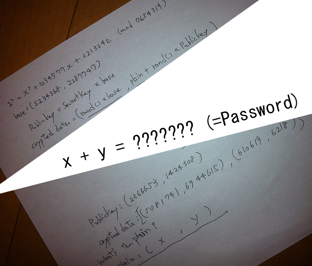

[RU](./ecc.md) | [EN](./ecc-en.md)

# ECC

## Обзор

ECC называется шифрованием с эллиптической кривой, EllipseCurve Cryptography, которая представляет собой криптографию с открытым ключом, основанную на математике эллиптических кривых. В отличие от традиционных методов шифрования, основанных на сложности крупномасштабной факторизации, ECC полагается на сложность решения задачи дискретного логарифмирования эллиптических кривых. Его главное преимущество состоит в том, что он может поддерживать такую ​​же надежность пароля при использовании более короткой длины ключа, чем другие методы. В настоящее время конечное поле, в основном используемое в эллиптической кривой, имеет

- Целочисленное поле GF(p), состоящее из простых чисел, обычно более эффективно на процессорах общего назначения.
- Поле Галуа GF(2^m) с характеристикой 2 может быть разработано с помощью специального оборудования.

## Базовые знания

Давайте сначала посмотрим на эллиптическую кривую на конечном поле. Эллиптическая кривая на конечном поле - это определение эллиптической кривой.

<p></p>

Все коэффициенты в конечном элементе GF (p) являются элементами, где p - большое простое число.

Конечно, не все эллиптические кривые подходят для шифрования. Наиболее распространены следующие уравнения:

<p></p>

Где 

Мы называем все решения (x, y), ($) уравнения и множество, называемое «точкой бесконечности» (O), как эллипс, определенный на Fp. Кривая обозначается E(Fp).

Обычно для определения паролей эллиптических кривых требуются следующие условия

Предположим, что E(Fp) для точечной операции  образует возможную группу (коммутативная группа, существование обратного элемента, замыкание и тд.), Множество  и t, удовлетворяющее следующим условиям, есть очень большой

<p></p>


Всего в операции участвуют t p. Здесь мы называем t периодом p. Кроме того, для  существует натуральное число m такое, что выполняется следующая формула, определяющая 

 (m p участвует в операции)

Кроме того, предположим, что G является генератором , то есть все элементы в нем могут быть сгенерированы, а порядок является наименьшим положительным целым числом n, удовлетворяющим .

## Эль-Гамал в ECC

Здесь мы предполагаем, что пользователь B хочет зашифровать сообщение и передать его пользователю A.

### Генерация ключей

Пользователь A сначала выбирает эллиптическую кривую , а затем выбирает на ней генератор G, предполагая, что его порядок равен n, а затем выбирает положительное целое число  в качестве ключа и вычисляет .

Среди них будут обнародованы .

Открытый ключ - , а закрытый ключ - .

### Шифрование

Пользователь B отправляет сообщение m пользователю A, предполагая, что сообщение m было закодировано как точка на эллиптической кривой, шаги шифрования следующие.

1. Запросить открытый ключ пользователя A .
2. Выберите случайное число k в интервале (1, q-1).
3. Вычислите точку  на основе открытого ключа A.
4. Вычислите точку . Если это O, перезапустите со второго шага.
5. Вычислить 
6. Отправить  в A.

### Расшифровка

Шаги расшифровки следующие

1. Вычислите точку , используя закрытый ключ.
2. Вычислите сообщение .

### Ключевой момент

Ключевым моментом здесь является то, что даже если мы знаем , трудно узнать k, что определяется сложностью задачи дискретного логарифмирования.

## 2013 SECCON CTF оценивает криптоанализ

В качестве примера мы берем криптоанализ в квалах SECCON CTF за 2013 год. Темы следующие:



Здесь мы знаем уравнение эллиптической кривой и соответствующую элементную базу генератора, а также знаем соответствующий модуль, открытый ключ и зашифрованный результат.

Но мы видим, что наш модуль слишком мал, мы бурно перечисляем результаты.

Здесь прямо имеется в виду программа sage на github, у которой закончился секретный ключ. Затем вы можете его расшифровать.

```python
a = 1234577
b = 3213242
n = 7654319
E = EllipticCurve(GF(n), [0, 0, 0, a, b])
base = E ([5234568, 2287747])
pub = E ([2366653, 1424308])
c1 = E ([5081741, 6744615])
c2 = E ([610619, 6218])
X = base
for i in range(1, n):
    if X == pub:
        secret = i
        print("[+] secret:", i)
        break
    else:
        X = X + base
        print(i)
m = c2 - (c1 * secret)
print("[+] x:", m[0])
print("[+] y:", m[1])
print("[+] x+y:", m[0] + m[1])
```

Насилие закончилось

```text
[+] secret: 1584718
[+] x: 2171002
[+] and: 3549912
[+] x+y: 5720914
```

## Справка

- <https://github.com/sonickun/ctf-crypto-writeups/tree/master/2013/seccon-ctf-quals/cryptanalysis>