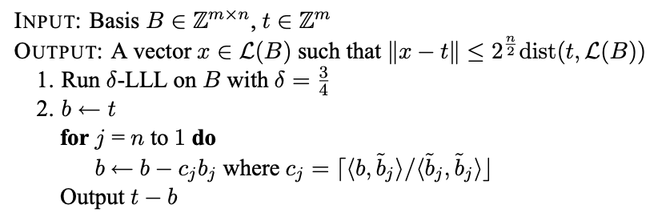

CVP - особенно важная проблема в криптографии на основе решеток.

Основное определение задачи таково: по заданному набору базисов и векторов $\mathbf{v}$ для $L$ найти ближайший к
$\mathbf{v}$ вектор на $L$.

<!--
TODO: Add more Lattice-based cryptography (CVP specifically) application intro here.
TODO: Make intro more descriptive and rigorous.
-->

## Алгоритмы

### Алгоритм ближайшего самолета Бабая

<!--
TODO: Add intro
-->

Алгоритм вводит набор решетки $L$ (ранг $n$), основу $B$ и целевой вектор $\mathbf{t}$, чтобы получить приближенное
решение проблемы CVP.

- Коэффициент аппроксимации равен $\gamma = 2^{\frac{n}{2}}$

Конкретный алгоритм:



- Где $c_j$ - округление коэффициентов в ортогонализации Грама-Шмидта, которое является округлением $proj_{b_{j}}(b)$.

Для личного понимания второго шага алгоритма: найдите линейную комбинацию, наиболее близкую к $\mathbf{t}$ в базе $B$
после базиса решетки и ортогонализации.

### Техника округления Бабая

Этот алгоритм представляет собой вариант `алгоритма ближайшей плоскости Бабая`.

Шаги могут быть выражены как:

N = rank(B), w = target

- $B' = LLL(B)$
- Найдите линейную комбинацию $[l_0, \ldots, l_N]$ такую, что $w = sum(l_i * b'_i)$.
- ($b'_i$ - `i`-й вектор в LLL-редуцированном базисе `B'`)
- Округлить каждое $l_i$ до ближайшего целого числа $l'_i$.
- Результат $v = sum(l'_i * b'_i)$

## Связанная информация

### Проблема со скрытым номером

Определение HNP следующее:

Учитывая простое число $p$, множество $t \in \mathbb{F}_p$ и каждый соответствующий $MSB_{l,p}(\alpha t)$, найдите
соответствующий $\alpha$.

- $MSB_{l,p}(x)$ означает любое целое число $u$, которое удовлетворяет $|(x \mod p) - u| \le \frac{p}{2^{l+1}}$, что
  примерно соответствует $l$ старшим разрядам $x \mod p$.

Согласно описанию в ссылке 3, когда $l \approx \log^{\frac{1}{2}}{p}$, следующий алгоритм может решить HNP:

Мы можем превратить эту проблему в проблему CVP на решетке, порожденной матрицей:

$$[ \begin{matrix} p, 0, \ldots, 0, 0 \\ 0, p, \ddots, \vdots, \vdots \\ \vdots, \ddots, \ddots, 0, \vdots \\ 0, 0, \dots, p, 0 \\ t_1, t_2, \ldots, t_{n}, \frac{1}{2^{l+1}} \end{matrix}]$$

Нам нужно найти ближайший вектор из $\mathbf{u}=(u_1, u_2, \ldots, u_{n}, 0)$ на решетке, поэтому здесь мы можем
использовать `алгоритм ближайшей плоскости Бабая`. Наконец, мы можем получить набор векторов $\mathbf{v}=(\alpha \cdot
t_1 \mod p, \alpha \cdot t_2 \mod p, \dots, \frac{\alpha}{2^{l+1} })$, который вычисляет $\alpha$.

### Example

??? example "BCTF 2018 - guess_number"
    В теме представлен код на стороне сервера:
    
    ```python
    import random, sys
    
    from flag import FLAG
    
    import gmpy2
    
    
    def msb(k, x, p):
        delta = p >> (k + 1)
        ui = random.randint(x - delta, x + delta)
        return ui
    
    
    def main():
        p = gmpy2.next_prime(2 ** 160)
        for _ in range(5):
            alpha = random.randint(1, p - 1)
            t = u = []
            k = 10
            for i in range(22):
                t.append(random.randint(1, p - 1))
                u.append(msb(k, alpha * t[i] % p, p))
            print(str(t))
            print(p(u))
            guess = input('Input your guess number: ')
            guess = int(guess)
            if guess != alpha:
                exit(0)
    
    
    if __name__ == "__main__":
        main()
        print(FLAG)
    ```
    
    Как видите, программа выполняет всего 5 раундов. В каждом раунде программа генерирует случайный $\alpha$ и 22 
    случайных $t_i$. Для каждого $t_i$ программа возьмет $u_i = MSB_{10,p}(\alpha\cdot{t_i\mod{p}})$ и отправит его 
    клиенту. Нам нужно вычислить соответствующий $\alpha$ на основе предоставленных $t_i$ и $u_i$. Как видите, проблема
    является типичной проблемой со скрытым числом, поэтому вы можете использовать приведенный выше алгоритм для решения:
    
    ```python
    import socket
    
    import ast
    import telnetlib
    
    # HOST, PORT = 'localhost', 9999
    HOST, PORT = '60.205.223.220', 9999
    
    s = socket.socket()
    s.connect((HOST, PORT))
    f = s.makefile('rw', 0)
    
    
    def recv_until(f, delim='\n'):
        buf = ''
        while not buf.endswith(delim):
            buf += f.read(1)
        return buf
    
    
    p = 1461501637330902918203684832716283019655932542983
    k = 10
    
    
    def solve_hnp(t, u):
        def babai(A, w):
            A = A.LLL(delta=0.75)
            G = A.gram_schmidt()[0]
            t = w
            for i in reversed(range(A.nrows())):
                c = ((t * G[i]) / (G[i] * G[i])).round()
                t -= A[i] * c
            return w - t
    
        # http://www.isg.rhul.ac.uk/~sdg/igor-slides.pdf
        M = Matrix(RationalField(), 23, 23)
        for i in range(22):
            M[i, i] = p
            M[22, i] = t[i]
    
        M[22, 22] = 1 / (2 ** (k + 1))
        closest = babai(M, vector(u + [0]))
        return (closest[-1] * (2 ** (k + 1))) % p
    
    
    for i in range(5):
        t = ast.literal_eval(f.readline().strip())
        u = ast.literal_eval(f.readline().strip())
        alpha = solve_hnp(t, u)
        recv_until(f, 'number: ')
        s.send(str(alpha) + '\n')
    
    t = telnetlib.Telnet()
    t.sock = s
    t.interact()
    ```

## Справка

- [Лекция 3 - алгоритм CVP](<https://cims.nyu.edu/~regev/teaching/lattices_fall_2004/ln/cvp.pdf>)
- [Википедия](<https://en.wikipedia.org/wiki/Lattice_problem>)
- [Игра в прятки в конечных полях: проблема скрытых чисел и ее приложения](<http://www.isg.rhul.ac.uk/~sdg/igor-slides.pdf>)
- [CryptoBook](<https://www.math.auckland.ac.nz/~sgal018/crypto-book/ch18.pdf>)