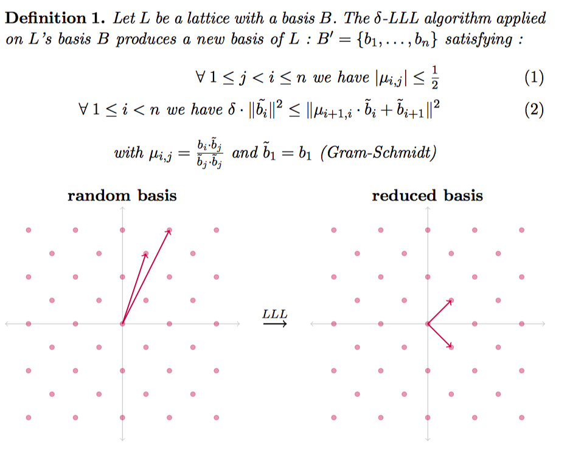
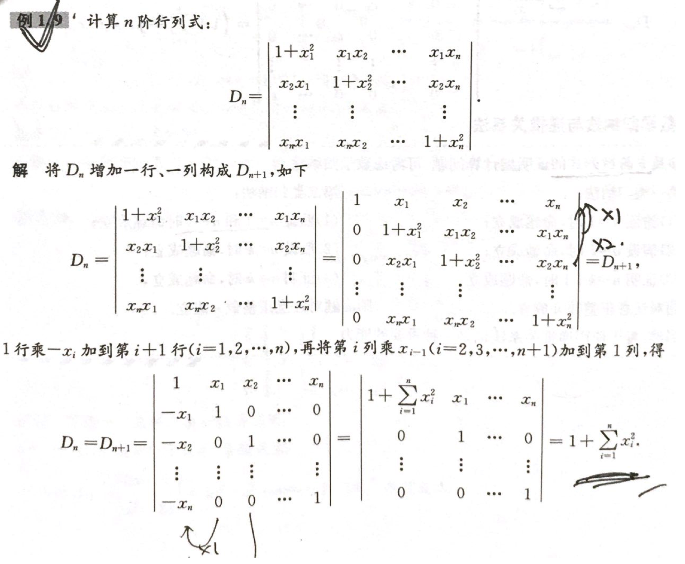

## Basic introduction

The $LLL$ algorithm is to find a set of bases on the lattice, which satisfies the following effects.

Moreover, the following properties of the base generated by this method are very useful.

## Simple application

Here I will give a second example from $LLL$ paper. Given n real numbers $\alpha_i,\ldots,\alpha_n$, find the rational
linear approximation of the $n$ numbers, ie find n numbers $m_i$, so that $\sum_{i=1}^{n }m_i\alpha_i$ is equal to 0 as
much as possible. We can construct a matrix like this, where $a_i$ is a rational approximation of $\alpha_i$.

$$A=\begin{bmatrix} 1, 0, 0, \cdots, 0, ca_1 \\ 0, 1, 0, \cdots, 0, c a_2 \\ 0, 0, 1, \cdots, 0, c a_3 \\ \vdots, \vdots, \vdots, \ddots, \vdots, \vdots \\ 0, 0, 0, \cdots, 1, c a_n \\ \end{bmatrix}$$

The matrix is $n*(n+1)$, we can find the determinant corresponding to this lattice according to the method of finding the
determinant.

$$Det(L)=\sqrt{AA^T}$$

We further consider such a matrix

$$A=\begin{bmatrix} 1, 0, 0, \cdots, 0, a_1 \\ 0, 1, 0, \cdots, 0, a_2 \\ 0, 0, 1, \cdots, 0, a_3 \\ \vdots, \vdots, \vdots, \ddots, \vdots, \vdots \\ 0, 0, 0, \cdots, 1, a_n \\ \end{bmatrix}$$

Then

$$AA^T=\begin{bmatrix} 1+a_1^2, a_1 a_2, a_1 a_3, \cdots, a_1 a_n \\ a_2 a_1, 1+a_2^2, a_2 a_3, \cdots, a_2 a_n \\ a_3 a_1, a_3 a_2, 1+a_3^2, \cdots, a_3 a_n \\ \vdots, \vdots, \vdots, \ddots, \vdots \\ a_n a_1, a_n a_2, a_n a_3, \cdots, 1+a_n^2 \\ \end{bmatrix}$$

Further, let's try it from low-dimensional to high-dimensional (strictly prove that you can consider adding a row and a
column, the upper left corner is 1), and the determinant of the lattice is

$$\sqrt{1+\sum_{i=1}^n\alpha_i^2}$$

Can refer to the following proof of the postgraduate Yuge

Then after the $LLL$ algorithm, we can get

$$||b_1|| \leq 2^{\frac{n-1}{4}} (1+\sum_{i=1}^n\alpha_i^2)^{\frac{1}{2(n+1)}}$$

In general, the latter item tends to $1$ when it is opened $n$ times, because $a_i$ is a constant and is generally not
related to $n$, so

$$||b_1|| \leq 2^{\frac{n-1}{4}}*k$$

$k$ is relatively small. In addition, $b_1$ is a linear combination of the original vectors, then

$$b_1[n]=\sum_{i=1}^{n}m_ic*a_i=c\sum_{i=1}^{n}m_i*a_i$$

Obviously if $c$ is large enough, then the subsequent summation must be small enough to satisfy the above constraints.