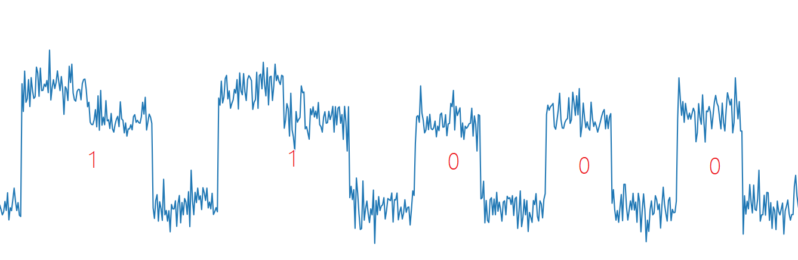

Атака с анализом энергии (атака по побочному каналу) - это метод атаки по паролю, с помощью которого можно получить
секретную информацию от криптографического устройства. Вместо него метод атаки отличается: эта атака использует
характеристики энергопотребления криптографического устройства, а не математические характеристики криптографического
алгоритма. Атака с анализом энергии - это атака без вмешательства, которая позволяет злоумышленнику легко приобрести
оборудование, необходимое для реализации атаки: этот тип атаки представляет серьезную угрозу безопасности
криптографических устройств, таких как смарт-карты.

Атаки с энергетическим анализом являются очень важной частью области безопасности, и мы обсудим их здесь лишь кратко.

Атаки энергетического анализа делятся на:

- Атака простого анализа энергии (SPA), которая позволяет визуально анализировать энергетические следы и увидеть
  невооруженным глазом.
- Атака дифференциального анализа энергии (DPA), основанная на коэффициентах корреляции между дорожками энергии.

## Условия атаки

Злоумышленник может получить информацию о побочном канале, относящуюся к шифрованию и дешифрованию, такую как 
потребление энергии, время вычислений, электромагнитное излучение и тп.

## Пример

В качестве примера мы возьмем Hack in the card I of HITB 2017.

В разделе приводится файл открытого ключа `publickey.pem`, зашифрованный текст, принципиальная схема для измерения 
мощности смарт-карты и энергопотребления, потребляемого смарт-картой во время **дешифрования** (данные трассировки через 
онлайн-сайт (<http://47.74.147.53:20015/index.html>)).

Зашифрованный текст:

```text
014b05e1a09668c83e13fda8be28d148568a2342aed833e0ad646bd45461da2decf9d538c2d3ab245b272873beb112586bb7b17dc4b30f0c5408d8b03cfbc8388b2bd579fb419a1cac38798da1c3da75dc9a74a90d98c8f986fd8ab8b2dc539768beb339cadc13383c62b5223a50e050cb9c6b759072962c2b2cf21b4421ca73394d9e12cfbc958fc5f6b596da368923121e55a3c6a7b12fdca127ecc0e8470463f6e04f27cd4bb3de30555b6c701f524c8c032fa51d719901e7c75cc72764ac00976ac6427a1f483779f61cee455ed319ee9071abefae4473e7c637760b4b3131f25e5eb9950dd9d37666e129640c82a4b01b8bdc1a78b007f8ec71e7bad48046
```

### Анализ

Поскольку сайт дает только энергетический след, можно сделать вывод, что это атака с использованием простого анализа 
каналов (SPA). Затем мы можем напрямую получить ключ d процесса дешифрования RSA, наблюдая за высоким и низким уровнями 
энергетической трассы. Теоретическая основа для атак RSA с помощью SPA исходит из алгоритма быстрого остатка мощности, 
включенного в RSA.

Алгоритм быстрой мощности следующий

1. Когда $b$ - четное, $a^b \bmod c = {a^2}^{b/2} \bmod c$.
2. Когда $b$ - нечетное, $a^b \bmod c = {a^2}^{b/2} \times a \bmod c$.

Соответствующий код реализован как:

=== "C"
    ```c
    int PowerMod(int a, int b, int c)
    {
        int ans = 1;
        a = a % c;
        while(b>0) {
            if(b % 2 == 1) // When b is odd, the following instructions will be executed more
                ans = (ans * a) % c;
            b = b/2;
            a = (a * a) % c;
        }
        return ans;
    }
    ```
=== "Python"
    ```python
    def power_mod(a, b, c):
        ans = 1
        a = a % c
        while b > 0:
            if b % 2 == 1:
                ans = (ans * a) % c
            b = b // 2
            a = a ** 2 % c
        return ans
    ```

Поскольку значение экспоненты оценивается побитно во время вычисления быстрой мощности и выполняются различные операции,
значение $d$ может быть восстановлено из графика энергии (из вышеизложенного, непосредственно полученное значение 
является двоичным значением $d$ - **обратный порядок**).

!!! info
    Иногда модульное умножение также можно перемножать от большего к меньшему. Вот умножение от низкого к высокому.



Скрипт, который восстанавливает $d$, можно дать вот такое:

```python
data = open('./data.txt').read().split(",")

print('point number:', len(data))

start_point = 225  # Точка старта
mid = 50  # Интервал
fence = 228  # Разделительная линия высокого и низкого уровня

bin_array = [1 if float(data[point_index]) > fence else 0 for point_index in range(start_point, len(data), mid)]
bin_array2 = []
flag1 = 0
flag2 = 0
for x in bin_array:
    if x:
        if flag1:
            flag2 = 1
        else:
            flag1 = 1
    else:
        bin_array2.append(1 if flag2 else 0)
        flag1 = flag2 = 0

d = "".join(map(str, bin_array2[::-1]))
print(d)
d_int = int(d, 2)
print(d_int)
```

## Ссылки

1. Mangard, S., Oswald, E., Popp, T., Feng Dengguo, Zhou Yongbin, and Liu Jiye. (2010). Energy Analysis Attack.