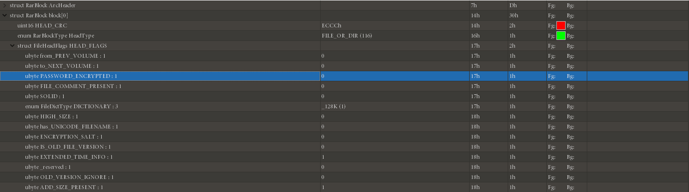

## Формат файла

Файл RAR в основном состоит из блока меток, блока заголовка сжатого файла, блока заголовка файла и завершающего блока.

Каждый из его блоков примерно разделен на следующие поля:

| Имя        | Размер | Описание                                  |
| :--------: | :----: | :---------------------------------------: |
| HEAD_CRC   | 2      | CRC для всех блоков или частей блока      |
| HEAD_TYPE  | 1      | Тип блока                                 |
| HEAD_FLAGS | 2      | Флаги блока                               |
| HEAD_SIZE  | 2      | Размер блока                              |
| ADD_SIZE   | 4      | Опциональное поле - Добавить размер блока |

Заголовок файла архива Rar: `52 61 72 21 1A 07 00`.

После заголовка файла (0x526172211A0700) идет блок маркера (MARK_HEAD), за которым следует заголовок файла.

| Имя           | Размер          | Описание                                                                                                                                           |
| :-----------: | :-------------: | :------------------------------------------------------------------------------------------------------------------------------------------------: |
| HEAD_CRC      | 2               | CRC полей от HEAD_TYPE до FILEATTR и имени файла                                                                                                   |
| HEAD_TYPE     | 1               | Тип заголовка: 0x74                                                                                                                                |
| HEAD_FLAGS    | 2               | Битовые флаги (Пожалуйста, см. Таблицу «Битовые флаги для файла в архиве» для всех возможностей) (Псевдошифрование)                                |
| HEAD_SIZE     | 2               | Полный размер заголовка файла, включая имя файла и комментарии                                                                                     |
| PACK_SIZE     | 4               | Размер сжатого файла                                                                                                                               |
| UNP_SIZE      | 4               | Размер несжатого файла                                                                                                                             |
| HOST_OS       | 1               | Операционная система, используемая для архивации. (См. Таблицу «Индикаторы операционной системы».)                                                 |
| FILE_CRC      | 4               | CRC файла                                                                                                                                          |
| FTIME         | 4               | Дата и время в MS DOS формате                                                                                                                      |
| UNP_VER       | 1               | Версия RAR, нужно для извлечения файла (Номер версии зашифрован как 10 * Major version + minor version.)                                           |
| METHOD        | 1               | Способ упаковки (См. Таблицу «Способ упаковки» для всех возможных вариантов.)                                                                      |
| NAME_SIZE     | 2               | Размер имени файла                                                                                                                                 |
| ATTR          | 4               | Атребуты файла                                                                                                                                     |
| HIGH_PACK_SIZ | 4               | Старшие 4 байта 64-битного значения размера сжатого файла. Необязательное значение, присутствует, только если установлен бит 0x100 в HEAD_FLAGS.   |
| HIGH_UNP_SIZE | 4               | Старшие 4 байта 64-битного значения размера несжатого файла. Необязательное значение, присутствует, только если установлен бит 0x100 в HEAD_FLAGS. |
| FILE_NAME     | NAME_SIZE bytes | Имя файла - строка байт длиной NAME_SIZE                                                                                                           |
| SALT          | 8               | присутствует, если (HEAD_FLAGS & 0x400)! = 0                                                                                                       |
| EXT_TIME      | variable size   | присутствует, если (HEAD_FLAGS & 0x1000)! = 0                                                                                                      |

Конец RAR файла фиксированный:

| Имя поля   | Размер       |                       |
| :--------: | :----------: | :-------------------: |
| HEAD_CRC   | 2            | Всегда 0x3DC4         |
| HEAD_TYPE  | 1            | Тип заголовка: 0x7b   |
| HEAD_FLAGS | 2            | Всегда 0x4000         |
| HEAD_SIZE  | 2            | Размер блока = 0x0007 |

Смотреть больше: [RAR](<https://forensicswiki.xyz/wiki/index.php?title=RAR>)

## Основная атака

### Blasting

- [RarCrack](<http://rarcrack.sourceforge.net/>) для Linux

### Pseudo encryption

Псевдошифрование файла RAR отображается в поле битового маркера в заголовке файла. Этот бит хорошо виден в 010 Editor.
Изменение этого бита может вызвать псевдошифрование.

Остальные атаки с открытым текстом такие же, как и в ZIP-архиве.
