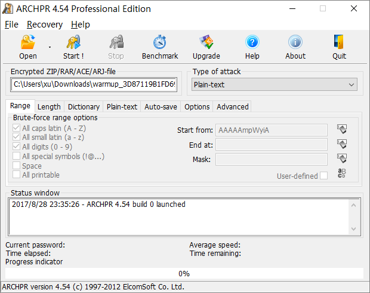
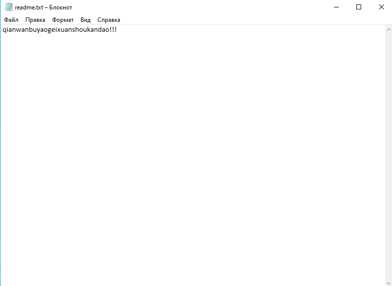
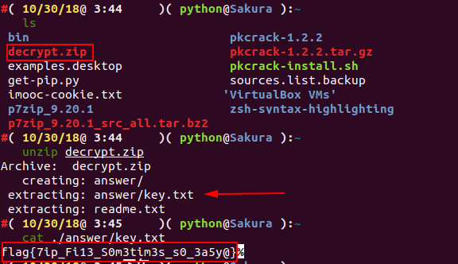

## Структура файла

`ZIP` файл в основном состоит из трех частей, соответственно.

| Область данных сжатого исходного файла                        | Основной каталог    | Конец каталога                     |
| :-----------------------------------------------------------: | :-----------------: | :--------------------------------: |
| заголовок локального файла + данные файла + дескриптор данных | центральный каталог | конец записи центрального каталога |

Каждый сжатый исходный файл или каталог в области данных сжатого исходного файла представляет собой запись, где

- *заголовок локального файла* - заголовок файла используется для определения начала файла и информации о записанном
  сжатом файле. Идентификатор заголовка файла здесь начинается с фиксированного значения `50 4B 03 04` и также важен для
  заголовка `ZIP`.
- *данные файла* - файл данных записывает данные соответствующего сжатого файла
- *дескриптор данных* - дескриптор данных используется для определения конца сжатого файла. Эта структура появится
  только если 3 бита поля общего тега в соответствующем *заголовке локального файла* стоит 1. После сжатия исходных
  данных файла
- *Основной каталог*
- Информация каталога записанного сжатого файла и каждая запись области данных соответствует одному фрагменту данных в
  область данных сжатого исходного файла.

| Смещение | Байты | Описание                                                     |
| :------: | :---: | :----------------------------------------------------------: |
| 0        | 4     | Сигнатура заголовка файла центрального каталога = 0x02014b50 |
| 4        | 2     | Версия сделана                                               |
| 6        | 2     | Версия необходимая для извлечения (минимальная)              |
| 8        | 2     | Битовый флаг общего назначения                               |
| 10       | 2     | Метод сжатия                                                 |
| 12       | 2     | Время последнего изменения файла                             |
| 14       | 2     | Дата последнего изменения файла                              |
| 16       | 4     | CRC-32                                                       |
| 20       | 4     | Сжатый размер                                                |
| 24       | 4     | Несжатый размер                                              |
| 28       | 2     | Длина названия файла (n)                                     |
| 30       | 2     | Длина дополнительного поля (m)                               |
| 32       | 2     | Длина комментария файла (k)                                  |
| 34       | 2     | Номер диска, с которого начинается файл                      |
| 36       | 2     | Атрибуты внутреннего файла                                   |
| 38       | 4     | Атрибуты внешнего файла                                      |
| 42       | 4     | Относительное смещение местного заголовка                    |
| 46       | n     | Имя файла                                                    |
| 46+n     | m     | Дополнительное поле                                          |
| 46+n+m   | k     | Комментарий файла                                            |

- *Конец записи центрального каталога(EOCD)* идентификатор конца файла
- Конец идентификатора каталога находится в конце всего пакета архива и используется для обозначения конца сжатых данных
  каталога. Каждый сжатый файл должен иметь одну и только одну *EOCD* запись.

См. [Официальную документацию](<https://pkware.cachefly.net/webdocs/APPNOTE/APPNOTE-6.2.0.txt>)

## Основная атака

### Blasting

Существует две утилиты для blasting:

- Windows - ARCHPR



Грубый перебор, запуск словарей, атаки с открытым текстом, все.

- Linux - [fcrackzip](<https://github.com/hyc/fcrackzip>)

```shell
-b Указывает, что режим разорван, 
-c1 указывает тип пароля как чистое число, другие типы могут быть rtfm, 
-u этот параметр очень важен или не отображает взломанный пароль, 
-l 5-6 можно указать длину

root@kali:fcrackzip -b -c1 -u test.zip
```

### CRC32

#### Принцип

[`CRC`](<https://en.wikipedia.org/wiki/Cyclic_redundancy_check>) сам по себе означает избыточный контрольный код,
а `CRC32` означает, что генерируется `32-битное` контрольное значение (`8` шестнадцатеричное число). Поскольку `CRC32`
генерирует контрольное значение, каждый битовый `бит` исходного блока данных участвует в вычислении, поэтому, даже если
в блоке данных изменяется только один бит, будет получено другое значение `CRC32`.

Контрольная сумма `CRC32` присутствует во многих файлах, таких как файл `png`, а также контрольная сумма `CRC32`
в `ZIP-архиве`. Стоит отметить, что `CRC32` в `ZIP-архиве` - это значение контрольной суммы незашифрованного файла.

Это привело к атаке на основе `CRC32`.

- В файле очень мало содержимого (в основном в игре, это около `4 байтов`)
- Зашифрованный пароль очень длинный

Вместо того, чтобы извлекать пароль сжатого пакета, мы напрямую извлекаем содержимое исходного файла (обычно видимые
строки), чтобы получить желаемую информацию.

Например, мы создаем новый `flag.txt` с содержимым `123` и шифруем его паролем `!QAZXSW@#EDCVFR$`.


Мы пошли вычислить значение `CRC32` для файла и обнаружили, что оно соответствует значению `CRC32` на приведенном выше
рисунке.

```shell
File: flag.txt
Size: 3
Time: Tue, 29 Aug 2017 10:38:10 +0800
MD5: 202cb962ac59075b964b07152d234b70
SHA1: 40bd001563085fc35165329ea1ff5c5ecbdbbeef
CRC32: 884863D2
```

!!! warning 
    Значение `CRC32` всех возможных строк, которые мы перечислили во время взрыва, должно соответствовать значению 
    `CRC32` в области данных сжатого исходного файла.

=== "Python"

```python

import binascii
import itertools
from string import ascii_letters, digits

alph = ascii_letters + digits + '+/='
crcdict = {}

print('computing all possible CRCs...')
for x in itertools.product(list(alph), repeat=3):
    st = ''.join(x).encode()
    crc = hex(binascii.crc32(st))[2:]
    crcdict[crc] = st
print('Done!')

f = open('flag.zip', 'rb')
data = f.read()
f.close()
crc = data[14:18][::-1].hex()
if crc in crcdict:
    print(crcdict[crc])
else:
    print("FAILED!")

```

#### Пример

??? example "Abctf-2016: Zippy"
    В зависимости от размера файла в каждом сжатом пакете можно сделать вывод, что используется метод атаки `CRC32`, и
    получается содержимое каждого сжатого пакета, а затем после декодирования `Base64` получается зашифрованный сжатый
    пакет, и получается взрыв по `флагу`.

### Атака открытым текстом

#### Принцип

1. зашифрованный сжатый файл
2. Сжатые файлы для сжатых файлов, например, `2345`, сжаты `WinRAR`, `7z`. Номер версии `ZIP` и тд. можно понять через
  атрибуты файла. Если это платформа `Linux`, используйте `zipinfo -v` для просмотра деталей `ZIP-пакета`, включая
  алгоритмы шифрования и тд.
3. Знать некоторое непрерывное содержимое файла в архиве (не менее `12 байт`)

Если вам уже известна часть зашифрованного файла, например файл `readme.txt`, найденный на веб-сайте, вы можете
попытаться взломать его.

Сначала упакуйте этот текстовый файл в `ZIP-архив`, например `readme.txt` в `readme.zip`.

После завершения упаковки вам необходимо подтвердить, что алгоритм сжатия, используемый обоими, одинаков. Простой способ
судить - открыть файл с помощью `WinRAR`, и тот же файл сжат с тем же объемом. Если они одинаковы, это в основном
означает, что используемый алгоритм сжатия правильный. Если он другой, попробуйте другой алгоритм сжатия.

#### Утилиты

- Windows - ARCHPR
- Linux [PKCrack](<http://www.unix-ag.uni-kl.de/~conrad/krypto/pkcrack.html>)

!!! warning
    Рекомендуется использовать `ARCHPR Windows`. Он быстрее и стабильнее.

#### Пример

??? example "2015 Guangzhou Strong Net Cup: Blasting?"
    Прежде всего, у нас возник такой вопрос, название заголовка - **Blasting?**, очевидно, что эта проблема определенно
    заключается в использовании инструмента взлома, очень жестокого.
    
    **Первый шаг, проанализируйте сжатый файл пакета**
    
    После того, как мы загрузили этот архив, мы увидели, что имя файла - ***.zip**. Мы можем сразу придумать несколько
    способов взломать zip-пакет. Распаковываем zip-файл и обнаруживаем, что есть два файла, соответственно `Desktop.zip`
    и `readme.txt`, давайте посмотрим, что написано в `readme.txt`?
    
    
    
    После открытия это оказалось `qianwanbuyaogeixuanshoukandao!!!`, спрашивающий не хотел, чтобы игрок видел, этот вопрос
    все еще немного интересен. Давайте посмотрим на `Desktop.zip`. Мы видим, что есть файл `readme.txt` и папка `answer`. В
    папке `answer` есть файл `key.txt`. здесь должен быть скрыт `флаг`.
    
    **Шаг 2, проанализируйте метод взлома**
    
    Эта тема получила поддержку, мы сначала обнаружили, что извлеченный файл и `Desktop.zip` содержат один и тот же
    файл `readme.txt` и не содержат другой соответствующей информации, а размер файла превышает `12 байт`. Мы
    сравниваем `readme.txt` в сжатом пакете со значением `CRC32` в `readme.txt` в исходном сжатом пакете. Мы обнаружили, что
    эти два значения совпадают, что означает, что извлеченный файл `readme.txt` зашифрован и сжат. Открытый
    текст `readme.txt` в пакете, поэтому мы можем смело предположить, что это, вероятно, шифрование открытого текста.
    
    
    
    **Шаг 3, попробуйте атаку с открытым текстом**
    
    Теперь, когда мы знаем, что это атака с открытым текстом, мы взломаем сжатый пакет. Поскольку извлеченный
    файл `readme.txt` является открытым текстом файла `readme.txt` в зашифрованном архиве, сожмите файл `readme.txt` в
    файл **.zip*, а затем заполните соответствующий путь в программном обеспечении, чтобы начать атаку открытым текстом,
    здесь мы представим различные методы атака открытым текстом под `Windows` и `Ubuntu`.
    
    Метод 1, `pkcrack` для атаки с открытым текстом
    
    `pkcrack` Ссылка: <https://www.unix-ag.uni-kl.de/~conrad/krypto/pkcrack.html>
    
    Мы можем просто написать `shell`, чтобы загрузить его:
    
    ```shell
    #!/bin/bash -ex
    wget https://www.unix-ag.uni-kl.de/~conrad/krypto/pkcrack/pkcrack-1.2.2.tar.gz
    tar xzf pkcrack-1.2.2.tar.gz
    cd pkcrack-1.2.2/src
    make
    mkdir -p ../../bin
    cp extract findkey makekey pkcrack zipdecrypt ../../bin
    cd ../../
    ```
    
    Сохраните файл в `pkcrack-install.sh` и запустите его в текущем каталоге, предоставив ему разрешение на выполнение `x`.
    
    ```shell
    chmod 777 install.sh
    ```
    
    Или:
    
    ```shell
    chmod u+x install.sh
    ```
    
    Затем запустить `./pkcrack-install.sh`
    
    Затем в текущем каталоге будет создана папка `bin`. Мы напрямую войдем в папку `bin` и увидим файл `pkcrack`, который
    будет непосредственно взламывать файл.
    
    ```shell
    ./pkcrack -c readme.txt -p readme.txt -C ~/download/misc/Desktop.zip -P ~/download/misc/readme.zip -d ~/decrypt.zip
    ```
    
    Мы использовали следующие параметры параметров:
    
    ```shell
    -C: целевой файл для взлома (включая путь)
    -c: взломать имя файла с открытым текстом в файле (путь не включает системный путь, начиная с уровня zip файла)
    -P: сжатый текстовый файл
    -p: имя файла с открытым текстом в сжатом файле с открытым текстом (то есть расположение readme.txt в readme.zip)
    -d: Укажите имя файла и абсолютный путь, по которому он находится, и выведите расшифрованный zip-файл.
    ```
    
    Результаты после расшифровки следующие:
    
    
    
    
    
    
    
    
    
    Мы подошли к финальному флагу: flag **`{7ip_Fi13_S0m3tim3s_s0_3a5y@}`**
    
    **Яма приближается**
    
    Вроде все идет хорошо. На это ушло больше двух часов. Почему я написал в садике для блогов и два часа бегал без
    перерыва? Или, если друг столкнулся с той же проблемой, что и я, я, очевидно, такой же как и вы, почему у меня не могут
    закончиться результаты?
    
    Возможно, вы упустили из виду некоторые детали. Кто-то когда-то задумывался, как был сжат исходный пакет сжатия? И как
    мы создаем файл `readme.zip` и как его сгенерировать? Я просто не успел из-за этой проблемы три месяца. Если вы не
    верите, мы можем рассмотреть второй метод и использовать `ARCHPR` для атаки с открытым текстом под `Windows`.
    
    Метод 2, `ARCHPR` для атаки с открытым текстом
    
    Прежде всего, я предлагаю вам установить версию `ARCHPR 4.53`. Я успешно протестировал его в этой версии. Удачные
    скриншоты выглядят следующим образом:
    
    
    
    Думаю, многие из моих друзей сталкивались со следующей ситуацией при использовании `ARCHPR`:
    
    
    
    В то время я был в состоянии коллапса, и это произойдет.
    
    При более позднем обучении было обнаружено, что файлы, сжатые с помощью `7z`, были распакованы с помощью `7z`, который
    представляет собой формат файла, использующий несколько алгоритмов сжатия для сжатия данных, и традиционный `zip`,
    `rar` по сравнению с ним степень сжатия больше, а степень сжатия алгоритм используется другой. Естественно может быть
    несовпадение. Следовательно, мы должны проанализировать исходного человека при распаковке исходного сжатого пакета и
    шифровании файла. Каким образом можно зашифровать и расшифровать, поэтому проблема этого вопроса очевидна. После
    проверки выяснил, что сабж сжат с помощью `7z`.
    
    **Попробуй еще раз**
    
    Мы нашли эту проблему, заходим на официальный сайт, чтобы скачать `7zip`: <https://www.7-zip.org/>
    
    Затем мы распаковываем исходный сжатый файл с помощью `7z`, а затем сжимаем `readme.txt` с помощью `7z`. Затем мы можем
    использовать `ARCHPR` для атак с открытым текстом.
    
    Результаты приведены ниже:
    
    
    
    Мы разархивировали `Desktop_decrypted.zip` и проверили `key.txt` в каталоге `answer`.
    
    Итак, последний флаг: `flag{7ip_Fi13_S0m3tim3s_s0_3a5y@}`

### Псевдошифрование

#### Принцип

В *области основного каталога* в формате `ZIP` выше мы выделяем `2 байта`, называемые битовым флагом общего
назначения, который имеет разные значения.

```shell
Bit 0: Если установлено, означает, что файл зашифрован.
(For Method 6 - Imploding)
Bit 1: Если использовался метод сжатия типа 6,
     Imploding, тогда этот бит, если установлен, указывает
     был использован скользящий словарь 8K. Если ясно,
     затем использовался скользящий словарь 4K.
...
Bit 6: Надежное шифрование. Если этот бит установлен, вы должны
     установите версию, необходимую для извлечения значения как минимум
     50, и вы также должны установить бит 0. Если шифрование AES
     используется версия, необходимая для извлечения значения, должна
     быть не менее 51.
...
```

В `010Editor` мы пытались изменить этот `1` бит на `0 -> 1`.


Снова откройте файл и обнаружите, что запрашивали пароль.


Измените метод псевдошифровки:

- Измените универсальную битовую метку в `16`
- `binwalk -e` игнорирует псевдошифрование
- В `Mac OS` и некоторых системах `Linux` (например, `Kali`) вы можете напрямую открыть псевдошифрованный `ZIP-пакет`.
- Обнаружить псевдошифрованный гаджет `ZipCenOp.jar`
- Иногда с функцией исправления `WinRar` (этот метод иногда дает чудесный эффект, не только для псевдошифровки)
