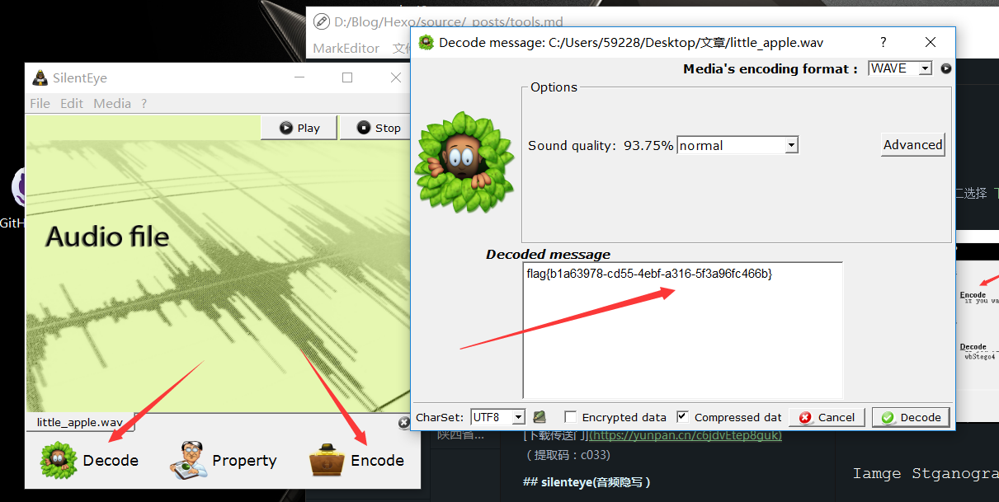

The audio-related CTF topics mainly use steganography strategies, which are mainly divided into MP3 steganography, LSB
steganography, waveform steganography, spectrum steganography, and so on.

## MP3 steganography

### Principle

MP3 steganography is mainly using the [Mp3Stego](<http://www.petitcolas.net/steganography/mp3stego/>) tool for
the steganography. The basic introduction and usage are as follows:

!!! info
    MP3Stego will hide information in MP3 files during the compression process. The data is first compressed, 
    encrypted and then hidden in the MP3 bit stream.

```shell
encode -E hidden_text.txt -P pass svega.wav svega_stego.mp3
decode -X -P pass svega_stego.mp3
```

### Example

??? example "ISCC-2016: Music Never Sleep"
    After the initial observation, no one was found by `strings`, and there was no abnormal guess in listening to the audio.
    The steganography software was used to hide the data.
    
    
    
    After getting the password, use `Mp3Stego` to decrypt it.
    
    ```shell
    decode.exe -X ISCC2016.mp3 -P bfsiscc2016
    ```
    
    Get the file `iscc2016.mp3.txt`:
    
    ```
    Flag is SkYzWEk0M1JOWlNHWTJTRktKUkdJTVpXRzVSV0U2REdHTVpHT1pZPQ== ???
    ```
    
    Get flag after `Base64` and `Base32`.
    
## Waveform

### Principle

Generally speaking, in the direction of the waveform, after observing the abnormality, the relevant software (Audacity,
Adobe Audition, etc.) is used to observe the waveform law, and the waveform is further converted into a 01 string, etc.,
thereby extracting and converting the final flag.

### Example

??? example "ISCC-2017: Misc-04"
    In fact, the hidden information in this question is in the first part of the audio. If you don't listen carefully,
    you may mistake it for the steganography.

    

    The high is 1, low is 0 and is converted to get the `01` string.
    
    ```
    110011011011001100001110011111110111010111011000010101110101010110011011101011101110110111011110011111101
    ```

    Convert to ASCII, decrypt the Morse password and get the flag.

!!! warning
    Some of the more complicated ones may first perform a series of processing on the audio, such as filtering. 
    For example [JarvisOJ - Voice of God Writeup](<https://www.40huo.cn/blog/jarvisoj-misc-writeup.html>)

## Spectrum

### Principle

A spectral steganography in an audio hides strings in the spectrum. Such an audio usually has a more pronounced feature 
that sounds a bit murmur or harsh.

### Example

??? example "Su-ctf-quals-2014:hear_with_your_eyes"
    

## LSB audio steganography

### Principle

Similar to the LSB steganography in image steganography, there is also a corresponding LSB steganography in the audio.
The [Silenteye](<http://silenteye.v1kings.io/>) tool can be used mainly as follows.

!!! info 
    SilentEye is a cross-platform application design for an easy use of steganography, in this case hiding messages 
    into pictures or sounds. It provides a pretty nice interface and an easy integration of new steganography algorithm
    and cryptography process by using a plug-ins system.

### Example

??? example "2015 Guangdong Strong Net Cup - Little Apple"
    Just use `silenteye`.

    

## Reference

- [LSB in Audio](<https://ethackal.github.io/2015/10/05/derbycon-ctf-wav-steganography/>)
- [Stealth Summary](<http://bobao.360.cn/learning/detail/243.html>)
