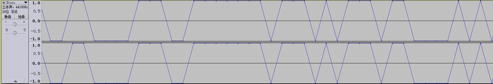
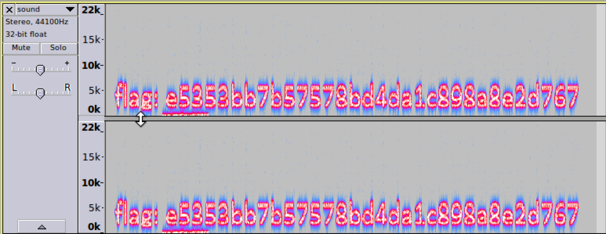
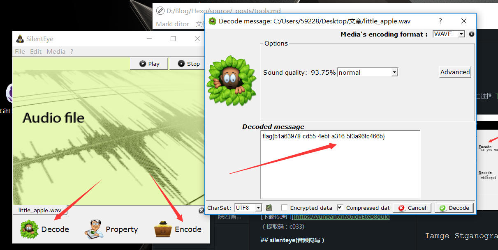

Темы CTF, связанные со звуком, в основном используют стеганографические стратегии, которые в основном делятся на
стеганографию MP3, стеганографию LSB, стеганографию формы волны, стеганографию спектра и так далее.

## Общие средства

Информация, которую можно найти через `binwalk` и `strings`, не детализирована.

## MP3 стеганография

### Принцип

В стеганографии MP3 в основном используется инструмент [Mp3Stego](<http://www.petitcolas.net/steganography/mp3stego/>)
для стеганографии. Основное введение и использование следующие:

!!! info 
    MP3Stego скроет информацию в файлах MP3 во время процесса сжатия. Данные сначала сжимаются, шифруются, а затем 
    скрываются в битовом потоке MP3.

```shell
encode -E hidden_text.txt -P pass svega.wav svega_stego.mp3
decode -X -P pass svega_stego.mp3
```

### Пример

??? example "ISCC-2016: Music Never Sleep"
    После первоначального наблюдения никого не нашли по `strings`, и при прослушивании звука не было никаких отклонений
    от нормы. Для сокрытия данных использовалось стеганографическое программное обеспечение.

    

    После получения пароля используйте `Mp3Stego` для его расшифровки.

    ```shell
    decode.exe -X ISCC2016.mp3 -P bfsiscc2016
    ```

    Получаем файл `iscc2016.mp3.txt`:

    ```
    Flag is SkYzWEk0M1JOWlNHWTJTRktKUkdJTVpXRzVSV0U2REdHTVpHT1pZPQ== ???
    ```

    Получить флаг после `Base64` и `Base32`.

## Waveform

### Принцип

Вообще говоря, в направлении формы волны, после обнаружения отклонения от нормы, соответствующее программное
обеспечение (Audacity, Adobe Audition и тд.) Используется для наблюдения за законом формы волны, и форма волны далее
преобразуется в строку 01 и тд., Тем самым извлечение и преобразование финального флага.

### Пример

??? example "ISCC-2017: Misc-04"
    Фактически, скрытая информация в этом вопросе находится в первой части аудио. Если вы не слушаете внимательно, вы можете
    принять это за стеганографию.

    
    
    Максимум равен 1 минимуму, а 0 преобразуется в строку `01`.

    ```
    110011011011001100001110011111110111010111011000010101110101010110011011101011101110110111011110011111101
    ```
    
    Преобразуйте в ASCII, расшифруйте пароль Морзе и получите флаг.

!!! warning
    Некоторые из более сложных могут сначала выполнять серию обработки звука, например фильтрацию. Например 
    [JarvisOJ - Voice of God Writeup](<https://www.40huo.cn/blog/jarvisoj-misc-writeup.html>)

## Спектр

### Принцип

Спектральная стеганография в аудио скрывает струны в спектре. Такой звук обычно имеет более выраженную особенность,
которая звучит немного шумно или резко.

### Пример

??? example "Su-ctf-quals-2014:hear_with_your_eyes"
    

## LSB аудио-стеганография

### Принцип

Подобно стеганографии LSB в стеганографии изображений, в звуке также есть соответствующая стеганография LSB.
Инструмент [Silenteye](<http://silenteye.v1kings.io/>) можно использовать в основном следующим образом:

!!! info 
    SilentEye - это кроссплатформенное приложение, позволяющее легко использовать стеганографию, в данном случае 
    скрывая сообщения в изображениях или звуках. Он обеспечивает довольно приятный интерфейс и простую интеграцию нового 
    алгоритма стеганографии и процесса криптографии с помощью системы плагинов.

### Пример

??? example "2015 Guangdong Strong Net Cup - Little Apple"
    Просто используйте `silenteye`.
    
    

## Продолжение

- [LSB в аудио](<https://ethackal.github.io/2015/10/05/derbycon-ctf-wav-steganography/>)
- [Краткое описание скрытности](<http://bobao.360.cn/learning/detail/243.html>)
