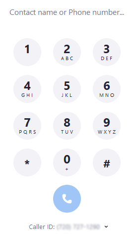

## Телефонный код набора

1-9 использует 1-9 импульсов соответственно, а 0 означает 10 импульсов.

## Кодировка Морзе

См. [Кодировка Морзе - Википедия](<https://en.wikipedia.org/wiki/Morse_code>), соответствующая таблица выглядит 
следующим образом

### Характеристики

- только `.` и `-`;
- до 6 символов;
- Он также может быть представлен строкой `01`.

## Код нажатия

Tap-код - это очень простой способ кодирования текстовой информации. Поскольку код назван в честь информации,
закодированной с использованием серии звуков щелчков, код попадания основан на квадратном массиве Polibiz 5 × 5, разница
в том, что буква K интегрирована в C.

|Tap-код|1    |2    |3    |4    |5    |
|:-----:|:---:|:---:|:---:|:---:|:---:|
|1      |A    |B    |C/K  |D    |E    |
|2      |F    |G    |H    |I    |J    |
|3      |L    |M    |N    |O    |P    |
|4      |Q    |R    |S    |T    |U    |
|5      |V    |W    |X    |Y    |Z    |

## Манчестерское кодирование

- [Манчестерское кодирование - Википедия](<https://en.wikipedia.org/wiki/Manchester_code>)

## Серое кодирование

- [Серое кодирование - Википедия](<https://en.wikipedia.org/wiki/Gray_code>)