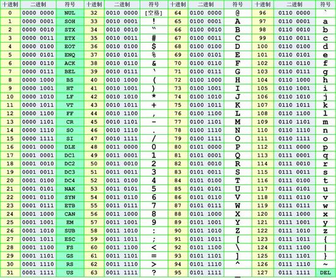

## Код алфавита

- AZ/az соответствует 1-26 или 0-25

## Кодировка ASCII



### Характеристики

Кодировка ascii, которую мы обычно используем, - это видимые символы, и в основном следующие символы

- 0-9 -> 48-57
- A-Z -> 65-90
- a-z -> 97-122

### Морфология

#### Бинарный код

Замените число, соответствующее коду ascii, двоичным представлением.

- Только 0 и 1
- Не более 8 бит, обычно возможно также 7 бит, потому что видимых символов до 127.
- Собственно другой код ascii.

#### Шестнадцатеричный код

Замените число, соответствующее коду ascii, на шестнадцатеричное представление.

- A-Z -> 41-5A
- a-z -> 61-7A

### Example

??? example "2018 DEFCON Quals ghettohackers: Throwback"
    Название описано ниже
    
    ```
    Anyo!e!howouldsacrificepo!icyforexecu!!onspeedthink!securityisacomm!ditytop!urintoasy!tem!
    ```

    Во-первых, мы должны завершить содержимое этих восклицательных знаков, чтобы получить флаг, но после завершения этого
    недостаточно, тогда мы можем разделить исходную строку в соответствии с `!`, Тогда длина строки 1 соответствует букве 
    'a', длина 2 соответствует букве 'б' и тд.

    ```python
    ori = 'Anyo!e!howouldsacrificepo!icyforexecu!!onspeedthink!securityisacomm!ditytop!urintoasy!tem!'
    sp = ori.split('!')
    print(''.join(chr(97 + len(s) - 1) for s in sp))
    ```

    В свою очередь, вы можете предположить, что 0 символов - это пробелы. Потому что это просто делает оригинал 
    читабельным.

    ```
    dark logic
    ```

## BaseXX кодировка

XX указывает, сколько символов используется для кодирования. Например, base64 использует следующую кодировку
из 64 символов. Поскольку шестая степень двойки равна 64, каждые 6 битов представляют собой единицу, соответствующую
печатаемому символу. На 3 байта приходится 24 бита, что соответствует 4 блокам Base64, т.е. 3 байта должны быть
представлены 4 печатными символами. Его можно использовать как кодировку передачи для электронной почты. Печатные
символы в Base64 включают буквы AZ, az, цифры 0-9, которые в общей сложности содержат 62 символа, и два печатаемых
символа различаются в разных системах.


См. [Base64 - Wikipedia](<https://en.wikipedia.org/wiki/Base64>).

Если количество байтов, которые должны быть закодированы, не может делиться на 3, и в конце будет еще 1 или 2 байта, вы
можете использовать следующий метод: сначала используйте значение 0, чтобы восполнить в конце, чтобы оно может делиться
на 3, а затем закодировать base64. Добавьте одно или два `=` числа после закодированного текста base64, чтобы
представить количество байтов, которые нужно дополнить. То есть, когда остается последний октет (один байт), последний
6-битовый блок байтов base64 имеет четыре бита со значением 0, и, наконец, добавляются два знака равенства; если
остаются два последних октета Для раздела (2 байта) последний 6-битный блок базового байта имеет две цифры значения 0,
за которыми следует знак равенства.

Поскольку дополнение 0 декодирования не участвует в операции, информация может быть там скрыта.

Подобно base64, base32 использует 32 видимых символа для кодирования, а пятая степень 2 равна 32, поэтому 1 пакет на 5
бит. 5 байтов составляют 40 бит, что соответствует 8 пакетам base32, то есть 5 байтов представлены 8 символами base32.
Однако, если он меньше 5 байтов, первые 5 бит меньше 5 бит будут дополнены 5 битами, а оставшиеся пакеты будут дополнены
знаком '=' до тех пор, пока 5 байтов не будут заполнены. Видно, что base32 имеет только 6 знаков равенства. Например:


### Характеристики

- В конце base64 может быть `=`, но может быть до 2
- Base32 может иметь `=` в конце, но до 6
- Набор символов будет ограничен в зависимости от базы
- **Может потребоваться добавить знак равенства**
- **= то есть 3D**
- См. [base rfc](<https://tools.ietf.org/html/rfc4648>) для получения дополнительной информации.

### Примеры

??? example 
    Описание темы можно найти в
    ctf-challenge [каталог разной классификации base64-stego](<https://github.com/ctf-wiki/ctf-challenges/tree/master/misc/encode/computer/base64-stego>)
    Файл data.txt.

    Используйте скрипт для чтения стеганографической информации.

    ```python
    def deStego(stegoFile):
        b64table = "ABCDEFGHIJKLMNOPQRSTUVWXYZabcdefghijklmnopqrstuvwxyz0123456789+/"
        with open(stegoFile, 'r') as stegoText:
            message = ""
            for line in stegoText:
                try:
                    text = line[line.index("=") - 1:-1]
                    message += "".join([bin(0 if i == '=' else b64table.find(i))[2:].zfill(6) for i in text])[
                               2 if text.count('=') == 2 else 4:6]
                except:
                    pass
        return "".join([chr(int(message[i:i + 8], 2)) for i in range(0, len(message), 8)])
    
    print(deStego("text.txt"))
    ```

    На выходе:
    
    ```
    flag{BASE64_i5_amaz1ng}
    ```

## Кодирование Хаффмана

См. [Кодирование Хаффмана - Википедия](<https://en.wikipedia.org/wiki/Huffman_coding>).

## XXencoding

XXencode кодирует входной текст в единицах каждые три байта. Если последние оставшиеся данные меньше трех байтов,
недостающая часть заполняется нулями. Эти три байта имеют в общей сложности 24 бита и разделены на 4 группы по 6 битов.
Каждая группа выражена в десятичном формате, чтобы указать, что отображаемое значение будет находиться только в
диапазоне от 0 до 63. Замените символом позиции соответствующего значения.

```text
           1         2         3         4         5         6

 0123456789012345678901234567890123456789012345678901234567890123

 |         |         |         |         |         |         |

 +-0123456789ABCDEFGHIJKLMNOPQRSTUVWXYZabcdefghijklmnopqrstuvwxyz
```

См. [Xxencoding - Википедия](<https://en.wikipedia.org/wiki/Xxencoding>).

### Характеристики

- только цифры, прописные и строчные буквы
- +, -.

## Кодировка URL

См. [Кодировка URL - Википедия](<https://en.wikipedia.org/wiki/Percent-encoding>).

### Характеристики

- большое количество знаков процента

## Кодировка Unicode

См. [Unicode - Wikipedia](<https://en.wikipedia.org/wiki/Unicode>).

Обратите внимание, что у него четыре проявления.

### Пример

??? example
    Исходный текст: `The`

    &#x [Hex]: `&#x0054;&#x0068;&#x0065;`

    &# [Decimal]: `&#00084;&#00104;&#00101;`

    \U [Hex]: `\U0054\U0068\U0065`

    \U+ [Hex]: `\U+0054\U+0068\U+0065`
