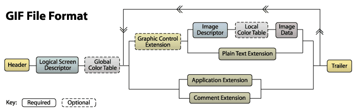

## Файловая структура

По структуре файл GIF можно разделить на

- Заголовок файла
- Подпись файла GIF (Подпись)
- Номер версии (Версия)
- Поток данных GIF
- Идентификатор контроля
- Блок изображения
- Некоторые другие блоки расширения
- Терминатор файлов (трейлер)

В следующей таблице показана структура файла GIF:



Большой кусок в середине можно повторять любое количество раз.

### Заголовок файла

Подпись GIF (Подпись) и номер версии (Версия). Подпись GIF используется для подтверждения того, находится ли файл в
формате `GIF`. Эта часть состоит из трех символов: `GIF`; номер версии файла также состоит из трех байтов, которые могут
быть `87a` или `89a`.

### Логический дескриптор экрана

Логический дескриптор экрана следует за заголовком. Этот блок сообщает декодеру, что изображение должно занимать место.
Он имеет фиксированный размер 7 байт и начинается с ширины и высоты холста.

### Глобальная таблица цветов

Формат GIF может иметь глобальную таблицу цветов или локальную таблицу цветов для каждого набора дополнительных
изображений. Таблица состоит из списка цветов RGB (как и тот, который мы обычно видим (255,0,0) красный).

### Дескриптор изображения

Файл GIF обычно содержит несколько изображений. Предыдущий режим рендеринга изображений обычно заключается в рисовании
нескольких изображений на большом (виртуальном холсте) на виртуальном холсте, а теперь эти коллекции обычно используются
для реализации анимации.

Каждое изображение начинается с блока дескриптора изображения, размер которого составляет 10 байтов.


### Данные изображения (данные изображения)

Наконец добрался до места, где фактически хранятся данные изображения. Данные изображения состоят из серии кодов вывода,
которые сообщают декодеру, что каждая информация о цвете должна быть нарисована на холсте. Эти коды организованы в этом
блоке в виде байт-кода.

### Терминатор файлов (трейлер)

Блок представляет собой блок с одним полем, который указывает конец потока данных. Возьмите фиксированное значение 0x3b.

См. [gif format image detail analysis](<http://www.jianshu.com/p/df52f1511cf8>)

## Space axis

Поскольку динамические характеристики GIF состоят из изображений одного кадра, комбинация изображений каждого кадра и
нескольких кадров изображений становится носителем скрытой информации.

Для файлов GIF, которые необходимо разделить, вы можете использовать команду `convert` для разделения каждого кадра.

```shell
root in ~/Desktop/tmp λ convert cake.gif cake.png
root in ~/Desktop/tmp λ ls
cake-0.png  cake-1.png  cake-2.png  cake-3.png  cake.gif
```

### Пример

??? example "WDCTF-2017:3-2"
    После открытия гифки идея очень понятна. После разделения каждого кадра изображения оно будет объединено, чтобы 
    получить полный QR-код.

    ```python
    from PIL import Image
    
    flag = Image.new("RGB", (450, 450))
    for i in range(2):
        for j in range(2):
            pot = "cake-{}.png".format(j + i * 2)
    
    potImage = Image.open(pot)
    flag.paste(potImage, (j * 225, i * 225))
    flag.save('./flag.png')
    ```

    После сканирования кода получаем строку шестнадцатеричных строк

    `03f30d0ab8c1aa5 .... 74080006030908`

    Запустите `03f3` в качестве заголовка файла `pyc`, восстановите его в сценарии `python` и запустите напрямую, чтобы
    получить флаг

## Лента новостей

Временной интервал между каждым кадром файла GIF также может служить носителем для сокрытия информации.

Например, во время отборочного конкурса XMan

### Пример

??? example "XMAN-2017:100.gif"
    Четко распечатайте временной интервал каждого кадра с помощью команды `identify`

    ```shell
    $ identify -format "%s %T \n" 100.gif
    0 66
    1 66
    2 20
    3 10
    4 20
    5 10
    6 10
    7 20
    8 20
    9 20
    10 20
    11 10
    12 20
    13 20
    14 10
    15 10
    ```

    Сделайте вывод, что 20 и 10 представляют 0 и 1, извлеките каждый интервал кадра и преобразуйте.

    ```shell
    $ cat flag|cut -d ' ' -f 2|tr -d '66'|tr -d '\n'|tr -d '0'|tr '2' '0'
    0101100001001101010000010100111001111011001110010011011000110101001101110011010101100010011001010110010101100100001101000110010001100101011000010011000100111000011001000110010101100100001101000011011100110011001101010011011000110100001100110110000101100101011000110110011001100001001100110011010101111101#
    ```

    Наконец, для получения флага используется код ASCII.

## Утилиты

- [F5-steganography](<https://github.com/matthewgao/F5-steganography>)