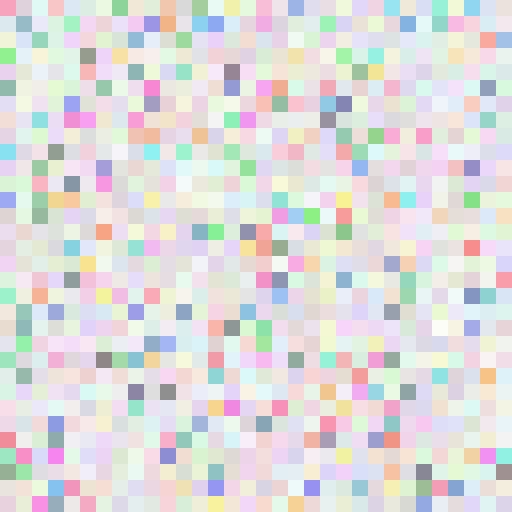

Image files are a good source of hacker culture, so various image files often appear in CTF contests.

Image files come in a variety of complex formats and can be used for a variety of analysis and decryption involving
metadata, loss of information and lossless compression, verification, steganography or visual data encoding, all of
which are important directions in Misc. There are a lot of knowledge points (including basic file formats, common
steganography and steganography software), and some places need to be deeply understood.

## Metadata

!!! info 
    Metadata, also known as mediation data, relay data, is data about data, mainly information describing the properties
    of the data, used to support such as storage location, historical data, resources Find, file, and more.

Hidden information in metadata is the most basic method in the game, usually used to hide some key `Hint` information or
some important information such as `password`.

You can view this type of metadata by right-clicking on the property, or by using the `strings` command. In
general, some hidden information (strange strings) often appears in the header.

Next, we introduce an `identify` command, which is used to get the format and characteristics of one or more image
files.

`-format` is used to specify the information displayed, and flexible use of its `-format` parameter can bring a lot of
convenience to solving
problems. [Format specific meaning of each parameter](<https://www.imagemagick.org/script/escape.php>)

### Example

??? example "Break In 2017 - Mysterious GIF"
    [link](<https://github.com/ctfs/write-ups-2017/tree/master/breakin-ctf-2017/misc/Mysterious-GIF>)

    One of the difficulties in this problem is to discover and extract the metadata in the GIF. First, `strings` can 
    observe the abnormal points.

    ```text
    GIF89a
       !!!"""###$$$%%%&&&'''((()))***+++,,,---...///000111222333444555666777888999:::;;;<<<===>>>???@@@AAABBBCCCDDDEEEFFFGGGHHHIIIJJJKKKLLLMMMNNNOOOPPPQQQRRRSSSTTTUUUVVVWWWXXXYYYZZZ[[[\\\]]]^^^___```aaabbbcccdddeeefffggghhhiiijjjkkklllmmmnnnooopppqqqrrrssstttuuuvvvwwwxxxyyyzzz{{{|||}}}~~~
    
    4d494945767749424144414e42676b71686b6947397730424151454641415343424b6b776767536c41674541416f4942415144644d4e624c3571565769435172
    NETSCAPE2.0
    
    ImageMagick
    
    ...
    ```

    The string of hexadecimal here is actually hidden in the metadata area of the GIF.
    
    The next step is extraction, you can choose Python, but it is more convenient to use `identify`

    ```shell
    root in ~/Desktop/tmp λ identify -format "%s %c \n" Question.gif
    
    0 4d494945767749424144414e42676b71686b6947397730424151454641415343424b6b776767536c41674541416f4942415144644d4e624c3571565769435172
    1 5832773639712f377933536849507565707478664177525162524f72653330633655772f6f4b3877655a547834346d30414c6f75685634364b63514a6b687271
    ...
    
    24 484b7735432b667741586c4649746d30396145565458772b787a4c4a623253723667415450574d35715661756278667362356d58482f77443969434c684a536f
    25 724b3052485a6b745062457335797444737142486435504646773d3d
    ```

    Other processes are not described here, please refer to the Writeup in the link.

## Pixel value conversion

Look at the data in this file, what can you think of?

```text
255,255,255,255,255...........
```

Is a string of RGB values, try to convert him into a picture

```python
from PIL import Image
from random import shuffle
import numpy as np


def pad_message(m, p):
    m_length = len(m)
    p_length = 1024 - m_length
    p_l = len(p)
    left_p = int(p_length / 2)

    pad_left = ''
    pad_right = ''
    for i in range(left_p):
        pad_left += p[i % p_l]
        pad_right += p[i % p_l]

    if p_length % 2 == 1:
        pad_right += p[(left_p + 1) % p_l]

    return pad_left + m + pad_right


def create_image_list(l, cols, rep):
    row_list = []
    i_list = []
    for i in range(len(l)):
        if (i + 1) % cols == 0:  # last column
            for j in range(rep):
                row_list.append(l[i])
                i_list.append(row_list)
            row_list = []
        else:
            for j in range(rep):
                row_list.append(l[i])
    return i_list


text = 'flag_here'
padding = 'owmybrain'
nums = list(map(ord, text))
diffs = [nums[0]] + [b - a for a, b in zip(nums[:-1], nums[1:])]
bf = ''.join([('-' if x < 0 else '+') * abs(x) + '.' for x in diffs])
message = pad_message(bf, padding)
counter = 0
rgb_list = []

for r in range(0, 256, 16):
    for g in range(0, 256, 32):
        for b in range(0, 256, 32):
            rgb_list.append([r, g, b, ord(message[counter])])
            counter += 1
shuffle(rgb_list)
img_list = create_image_list(rgb_list, 32, 16)
img = Image.fromarray(np.uint8(img_list)).convert('RGBA')
img.save('flag.png')
```

And if the other way around, extract the RGB values from a picture, and then compare the RGB values to get the final
flag.

Most of these topics are pictures of some pixel blocks, as shown below.



Related topics:

- [CSAW-2016-quals:Forensic/Barinfun](<https://github.com/ctfs/write-ups-2016/tree/master/csaw-ctf-2016-quals/forensics/brainfun-50>)
- [breakin-ctf-2017:A-dance-partner](<https://github.com/ctfs/write-ups-2017/tree/master/breakin-ctf-2017/misc/A-dance-partner>)