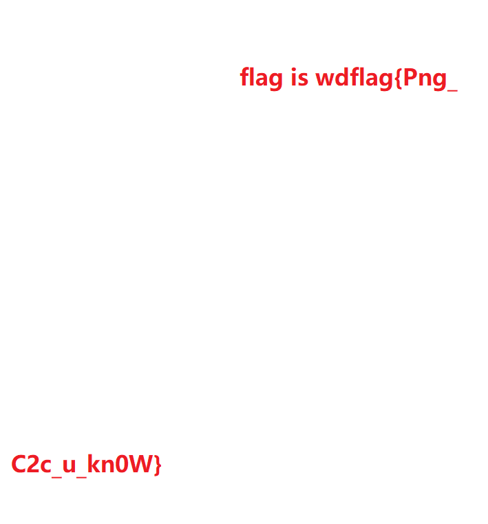
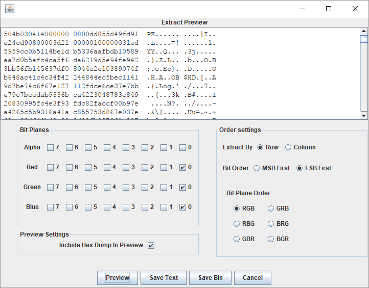

## File format

For a `PNG` file, the file header is always described by fixed-bit bytes, and the remaining part is composed of more
than 3 `PNG` data blocks (chunks) in a specific order.

File header `89 50 4E 47 0D 0A 1A 0A` + data block + data block + data block...

### Data block (chunk)

`PNG` defines two types of data blocks, one is called critical chunks, which are standard data blocks, and the other is
called ancillary chunks, which are optional data blocks. The key data block defines 4 standard data blocks, each `PNG`
file must contain them, and PNG reading and writing software must also support these data blocks.

| Data block signature | Data block name                       | Multiple data blocks | Optional           | Location restrictions      |
| :------------------: | :-----------------------------------: | :------------------: | :----------------: | :------------------------: |
| IHDR                 | File header data block                | :x:                  | :x:                | First piece                |
| cHRM                 | Base color and white point data block | :x:                  | :white_check_mark: | Before PLTE and IDAT       |
| gAMA                 | Image data block                      | :x:                  | :white_check_mark: | Before PLTE and IDAT       |
| sBIT                 | Sample effective bit data block       | :x:                  | :white_check_mark: | Before PLTE and IDAT       |
| PLTE                 | Palette data block                    | :x:                  | :white_check_mark: | Before IDAT                |
| bKGD                 | Background color data block           | :x:                  | :white_check_mark: | After PLTE before IDAT     |
| hIST                 | Image histogram data block            | :x:                  | :white_check_mark: | After PLTE before IDAT     |
| tRNS                 | Image transparent data block          | :x:                  | :white_check_mark: | After PLTE before IDAT     |
| oFFs                 | Private public data block             | :x:                  | :white_check_mark: | Before IDAT                |
| pHYs                 | Physical pixel size data block        | :x:                  | :white_check_mark: | Before IDAT                |
| sCAL                 | Private public data block             | :x:                  | :white_check_mark: | Before IDAT                |
| IDAT                 | Image data block                      | :white_check_mark:   | :x:                | Continuous with other IDAT |
| tIME                 | Image last modified time data block   | :x:                  | :white_check_mark: | Unlimited                  |
| tEXt                 | Text message data block               | :white_check_mark:   | :white_check_mark: | Unlimited                  |
| zTXt                 | Compressed text data block            | :white_check_mark:   | :white_check_mark: | Unlimited                  |
| fRAc                 | Private public data block             | :white_check_mark:   | :white_check_mark: | Unlimited                  |
| gIFg                 | Private public data block             | :white_check_mark:   | :white_check_mark: | Unlimited                  |
| gIFt                 | Private public data block             | :white_check_mark:   | :white_check_mark: | Unlimited                  |
| gIFx                 | Private public data block             | :white_check_mark:   | :white_check_mark: | Unlimited                  |
| IEND                 | End of image data                     | :x:                  | :x:                | Last data block            |

There is a unified data structure for each data block, and each data block consists of 4 parts

| Name            | Bytes    | Description                                                                                          |
| :-------------: | :------: | :--------------------------------------------------------------------------------------------------: |
| Length          | 4        | Specify the length of the data field in the data block, and its length does not exceed (231-1) bytes |
| Chunk Type Code | 4        | The data block type code consists of ASCII letters (A-Z and a-z)                                     |
| Chunk Data      | Variable | Store data specified in accordance with Chunk Type Code                                              |
| CRC             | 4        | Store the cyclic redundancy code used to detect errors                                               |

The value in the CRC (Cyclic Redundancy Check) field is calculated from the data in the Chunk Type Code field and Chunk
Data field.

### IHDR

File header data block `IHDR` (Header Chunk): It contains the basic information of the image data stored in the `PNG` 
file. It is composed of 13 bytes and appears as the first data block in the `PNG` data stream, and a `PNG` data stream.
There can only be one file header data block in

Among them, we are concerned about the content of the first 8 bytes

| Dimension name | Bytes | Description            |
| :------------: | :---: | :--------------------: |
| Width          | 4     | Image width, in pixels |
| Height         | 4     | Image height in pixels |

We often change the height or width of a picture to make a picture incomplete to achieve the purpose of hiding
information.


It can be found that this picture cannot be opened in Kali, prompting `IHDR CRC error`, and the picture viewer that
comes with Windows 10 can be opened, which reminds us that the `IHDR` block has been artificially tampered with, so we 
try to modify the picture. The height or width of the hidden string is found.

## Example

??? example "WDCTF-finals-2017"
    Observing the file, you can find that the file header and width are abnormal

    ```text
    00000000  80 59 4e 47 0d 0a 1a 0a  00 00 00 0d 49 48 44 52  |.YNG........IHDR|
    00000010  00 00 00 00 00 00 02 f8  08 06 00 00 00 93 2f 8a  |............../.|
    00000020  6b 00 00 00 04 67 41 4d  41 00 00 9c 40 20 0d e4  |k....gAMA...@ ..|
    00000030  cb 00 00 00 20 63 48 52  4d 00 00 87 0f 00 00 8c  |.... cHRM.......|
    00000040  0f 00 00 fd 52 00 00 81  40 00 00 7d 79 00 00 e9  |....R...@..}y...|
    ...
    ```

    It should be noted here that the file width cannot be arbitrarily modified. It needs to be blasted to get the width
    according to the CRC value of the `IHDR` block, otherwise the image display error cannot get the flag.

    ```python
    import binascii
    import struct
    
    misc = open("misc4.png", "rb").read()
    for i in range(1024):
        data = misc[12:16] + struct.pack('>i', i) + misc[20:29]
        crc32 = binascii.crc32(data) & 0xffffffff
        if crc32 == 0x932f8a6b:
            print(i)
    ```

    After getting the width value of 709, restore the picture to get the flag.

    

### PLTE

The palette data block `PLTE` (palette chunk): It contains the color transformation data related to the indexed-color
image. It is only related to the indexed-color image and should be placed in the image data chunk. The true
color `PNG` data stream can also have palette data blocks, the purpose is to facilitate non-true color display programs
to use it to quantify the image data, thereby displaying the image.

### IDAT

Image data chunk `IDAT` (image data chunk): It stores actual data, and the data stream can contain multiple consecutive
image data chunks.

- Store image number data
- The data stream can contain multiple consecutive image data blocks
- Compression using a derived algorithm of the `LZ77` algorithm
- Can be decompressed with `zlib`

It is worth noting that the `IDAT` block will only continue with a new block when the previous block is full.

Use `pngcheck` to view this `PNG` file

```shell
λ .\pngcheck.exe -v sctf.png
File: sctf.png (1421461 bytes)
  chunk IHDR at offset 0x0000c, length 13
    1000 x 562 image, 32-bit RGB+alpha, non-interlaced
  chunk sRGB at offset 0x00025, length 1
    rendering intent = perceptual
  chunk gAMA at offset 0x00032, length 4: 0.45455
  chunk pHYs at offset 0x00042, length 9: 3780x3780 pixels/meter (96 dpi)
  chunk IDAT at offset 0x00057, length 65445
    zlib: deflated, 32K window, fast compression
  chunk IDAT at offset 0x10008, length 65524
...
  chunk IDAT at offset 0x150008, length 45027
  chunk IDAT at offset 0x15aff7, length 138
  chunk IEND at offset 0x15b08d, length 0
No errors detected in sctf.png (28 chunks, 36.8% compression).
```

As you can see, the length of the normal block is full at 65524, while the length of the penultimate IDAT block is
45027, and the length of the last is 138. Obviously the last IDAT block is problematic because it should have been
Merged into the penultimate block that is not full.

Use `python zlib` to decompress the content of the redundant `IDAT` block. At this time, pay attention to removing the
length, data block type and the `CRC` check value at the end.

```python
import zlib
import binascii

IDAT = binascii.unhexlify("789...667")
result = binascii.hexlify(zlib.decompress(IDAT))
print(result)
```

### IEND

Image end data `IEND` (image trailer chunk): It is used to mark the end of the `PNG` file or data stream, and must be 
placed at the end of the file.

```text
00 00 00 00 49 45 4E 44 AE 42 60 82
```

The length of the `IEND` data block is always `00 00 00 00`, and the data identifier is always `IEND` `49 45 4E 44`.
Therefore, the `CRC` code is always `AE 42 60 82`.

### Remaining auxiliary data blocks

- bKGD（background color）
- cHRM（primary chromaticities and white point），The so-called whiteness refers to the whiteness produced on the display
  when R=G=B=maximum
- gAMA（image gamma）
- hIST（image histogram）
- pHYs（physical pixel dimensions）
- sBIT（significant bits）
- tEXt（textual data）
- tIME （image last-modification time）
- tRNS （transparency）
- zTXt （compressed textual data）

## LSB

LSB stands for Least Significant Bit, the least significant bit. The number of images in a PNG file is generally
composed of the three primary colors of RGB (red, green, and blue). Each color occupies 8 bits, and the value range
is `0x00` to `0xFF`, that is, there are 256 colors. Color, that is, 16,777,216 colors.

Human eyes can distinguish about 10 million different colors, which means that human eyes cannot distinguish about
6,777,216 remaining colors.

LSB steganography is to modify the lowest binary bit (LSB) of the RGB color components, each color will have 8 bits, LSB
steganography is to modify the lowest 1 bit in the image number, and human eyes will not notice the before and after
Change, each pixel can carry 3 bits of information.


If you are looking for such hidden traces of LSB, there is a
tool [Stegsolve](<http://www.caesum.com/handbook/Stegsolve.jar>) is an artifact that can assist us in our analysis.

You can observe the information of each channel through the buttons below, for example, view the information of the
lowest 8th bit plane of the R channel.


When using Stegsolve to view the information of LSB, you must carefully catch the abnormal points and catch the clues of
LSB steganography.

### Example

??? example "HCTF - 2016 - Misc"
    The information of this question is hidden in the lowest bits of the three RGB channels, and the channel can be
    specified for extraction with the help of `Stegsolve-->Analyse-->Data Extract`.

    
    
    You can find the `zip` header. After saving it as a compressed package with `save bin`, open and run the ELF file 
    in it to get the final flag.
    
    More research on LSB can be found [here](<https://zhuanlan.zhihu.com/p/23890677>).

## Tools

- [Stepic](<http://domnit.org/stepic/doc/>)
