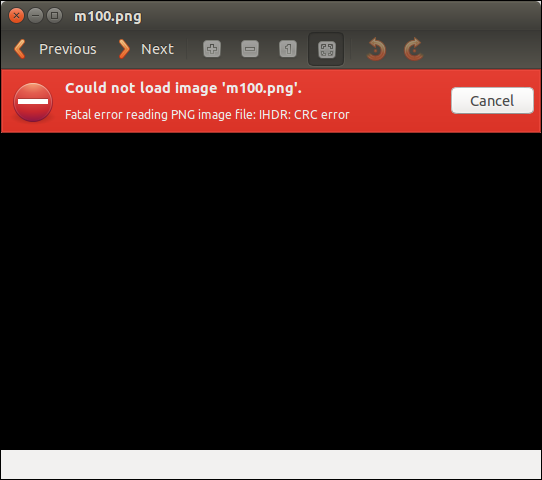

## Формат файла

Для файла `PNG` заголовок файла всегда описывается байтами с фиксированным битом, а оставшаяся часть состоит из более
чем 3 блоков данных `PNG` (фрагментов) в определенном порядке.

Заголовок файла `89 50 4E 47 0D 0A 1A 0A` + блок данных + блок данных + блок данных ...

### Блок данных (чанк)

`PNG` определяет два типа блоков данных: один называется критическими блоками, которые являются стандартными блоками
данных, а другой называется вспомогательными блоками, которые являются необязательными блоками данных. Ключевой блок
данных определяет 4 стандартных блока данных, каждый файл PNG должен содержать их, и программное обеспечение для чтения
и записи `PNG` также должно поддерживать эти блоки данных.

| Подпись блока данных | Имя блока данных                                       | Неск. блоков данных  | Необязательно      | Ограничения по местоположению |
| :------------------: | :----------------------------------------------------: | :------------------: | :----------------: | :---------------------------: |
| IHDR                 | Блок данных заголовка файла                            | :x:                  | :x:                | Начальная часть               |
| cHRM                 | Блок данных основного цвета и точки белого             | :x:                  | :white_check_mark: | Перед PLTE и IDAT             |
| gAMA                 | Блок данных изображения                                | :x:                  | :white_check_mark: | Перед PLTE и IDAT             |
| sBIT                 | Пример эффективного блока битовых данных               | :x:                  | :white_check_mark: | Перед PLTE и IDAT             |
| PLTE                 | Блок данных палитры                                    | :x:                  | :white_check_mark: | Перед IDAT                    |
| bKGD                 | Блок данных о цвете фона                               | :x:                  | :white_check_mark: | После PLTE перед IDAT         |
| hIST                 | Блок данных гистограммы изображения                    | :x:                  | :white_check_mark: | После PLTE перед IDAT         |
| tRNS                 | Блок данных прозрачного изображения                    | :x:                  | :white_check_mark: | После PLTE перед IDAT         |
| oFFs                 | Частный публичный блок данных                          | :x:                  | :white_check_mark: | Перед IDAT                    |
| pHYs                 | Блок данных физического размера пикселя                | :x:                  | :white_check_mark: | Перед IDAT                    |
| sCAL                 | Частный публичный блок данных                          | :x:                  | :white_check_mark: | Перед IDAT                    |
| IDAT                 | Блок данных изображения                                | :white_check_mark:   | :x:                | Продолжается с другими IDAT   |
| tIME                 | Блок данных времени последнего изменения изображения   | :x:                  | :white_check_mark: | Не ограничено                 |
| tEXt                 | Блок данных текстового сообщения                       | :white_check_mark:   | :white_check_mark: | Не ограничено                 |
| zTXt                 | Блок сжатых текстовых данных                           | :white_check_mark:   | :white_check_mark: | Не ограничено                 |
| fRAc                 | Частный публичный блок данных                          | :white_check_mark:   | :white_check_mark: | Не ограничено                 |
| gIFg                 | Частный публичный блок данных                          | :white_check_mark:   | :white_check_mark: | Не ограничено                 |
| gIFt                 | Частный публичный блок данных                          | :white_check_mark:   | :white_check_mark: | Не ограничено                 |
| gIFx                 | Частный публичный блок данных                          | :white_check_mark:   | :white_check_mark: | Не ограничено                 |
| IEND                 | Конец данных изображения                               | :x:                  | :x:                | Последний блок данных         |

Для каждого блока данных существует унифицированная структура данных, и каждый блок данных состоит из 4 частей.

| Имя            | Байт      | Описание                                                                        |
| :------------: | :-------: | :-----------------------------------------------------------------------------: |
| Длина          | 4         | Укажите длину поля данных в блоке данных, и его длина не превышает (231-1) байт |
| Код типа чанка | 4         | Код типа блока данных состоит из букв ASCII (A-Z и a-z)                         |
| Данные чанка   | Изменчиво | Хранить данные, указанные в соответствии с кодом типа блока                     |
| CRC            | 4         | Сохраните циклический избыточный код, используемый для обнаружения ошибок       |

Значение в поле CRC (Циклическая проверка избыточности) вычисляется на основе данных в поле Код типа чанка и Данные
чанка.

### IHDR

Блок данных заголовка файла IHDR(Заголовок чанка): он содержит основную информацию о данных изображения, хранящихся в
файле `PNG`. Он состоит из 13 байтов и отображается как первый блок данных в потоке данных `PNG` и поток данных `PNG`. В
нем может быть только один блок данных заголовка файла.

Среди них нас беспокоит содержимое первых 8 байтов.

| Название измерения | Байт  | Описание                   |
| :----------------: | :---: | :------------------------: |
| Ширина             | 4     | Ширина картинку в пикселях |
| Высота             | 4     | Высота картинку в пикселях |

Мы часто меняем высоту или ширину изображения, чтобы сделать изображение неполным, чтобы скрыть информацию.



Можно обнаружить, что это изображение не может быть открыто в Kali, что вызывает `IHDR CRC error`, и можно открыть
средство просмотра изображений, которое поставляется с Windows 10, что напоминает нам, что блок `IHDR` был искусственно
изменен, поэтому мы пытаемся изменить рисунок. Найдена высота или ширина скрытой строки.

## Example

??? example "WDCTF-finals-2017"
    Наблюдая за файлом, вы можете обнаружить, что заголовок и ширина файла ненормальны.

    ```text
    00000000  80 59 4e 47 0d 0a 1a 0a  00 00 00 0d 49 48 44 52  |.YNG........IHDR|
    00000010  00 00 00 00 00 00 02 f8  08 06 00 00 00 93 2f 8a  |............../.|
    00000020  6b 00 00 00 04 67 41 4d  41 00 00 9c 40 20 0d e4  |k....gAMA...@ ..|
    00000030  cb 00 00 00 20 63 48 52  4d 00 00 87 0f 00 00 8c  |.... cHRM.......|
    00000040  0f 00 00 fd 52 00 00 81  40 00 00 7d 79 00 00 e9  |....R...@..}y...|
    ...
    ```

    Здесь следует отметить, что ширина файла не может быть изменена произвольно. Его необходимо обработать, чтобы 
    получить ширину в соответствии со значением CRC блока `IHDR`, иначе ошибка отображения изображения не сможет 
    получить флаг.

    ```python
    import binascii
    import struct
    
    misc = open("misc4.png", "rb").read()
    for i in range(1024):
        data = misc[12:16] + struct.pack('>i', i) + misc[20:29]
        crc32 = binascii.crc32(data) & 0xffffffff
        if crc32 == 0x932f8a6b:
            print(i)
    ```

    После получения значения ширины 709 восстановите изображение, чтобы получить флаг.

    

### PLTE

Блок данных палитры `PLTE` (блок палитры): он содержит данные преобразования цвета, относящиеся к изображению с 
индексированными цветами. Он относится только к изображению с индексированными цветами и должен быть помещен в блок 
данных изображения. Поток данных `PNG` с истинным цветом может также иметь блоки данных палитры, цель состоит в том, 
чтобы облегчить использование программ отображения не истинных цветов для количественной оценки данных изображения, тем
самым отображая изображение.

### IDAT

Блок данных изображения `IDAT` (блок данных изображения): он хранит фактические данные, а поток данных может содержать 
несколько последовательных блоков данных изображения.

- Сохранение данных о номере изображения
- Поток данных может содержать несколько последовательных блоков данных изображения.
- Сжатие с использованием производного алгоритма алгоритма `LZ77`.
- Можно распаковать с помощью `zlib`

Стоит отметить, что блок `IDAT` продолжит работу с новым блоком только тогда, когда предыдущий блок будет заполнен.

Используйте `pngcheck` для просмотра этого файла `PNG`

```shell
λ .\pngcheck.exe -v sctf.png
File: sctf.png (1421461 bytes)
  chunk IHDR at offset 0x0000c, length 13
    1000 x 562 image, 32-bit RGB+alpha, non-interlaced
  chunk sRGB at offset 0x00025, length 1
    rendering intent = perceptual
  chunk gAMA at offset 0x00032, length 4: 0.45455
  chunk pHYs at offset 0x00042, length 9: 3780x3780 pixels/meter (96 dpi)
  chunk IDAT at offset 0x00057, length 65445
    zlib: deflated, 32K window, fast compression
  chunk IDAT at offset 0x10008, length 65524
...
  chunk IDAT at offset 0x150008, length 45027
  chunk IDAT at offset 0x15aff7, length 138
  chunk IEND at offset 0x15b08d, length 0
No errors detected in sctf.png (28 chunks, 36.8% compression).
```

Как видите, длина нормального блока составляет 65524, в то время как длина предпоследнего блока `IDAT` равна 45027, а 
длина последнего - 138. Очевидно, что последний блок `IDAT` проблематичен, потому что он должен был быть объединен с 
предпоследним блоком, который не заполнен.

Используйте `python zlib` для распаковки содержимого избыточного блока `IDAT`. В это время обратите внимание на удаление 
длины, типа блока данных и контрольного значения `CRC` в конце.

```python
import zlib
import binascii

IDAT = binascii.unhexlify("789...667")
result = binascii.hexlify(zlib.decompress(IDAT))
print(result)
```

### IEND

Данные конца изображения `IEND` (фрагмент трейлера изображения): используются для обозначения конца файла `PNG` или 
потока данных и должны быть помещены в конец файла.

```text
00 00 00 00 49 45 4E 44 AE 42 60 82
```

Длина блока данных `IEND` всегда `00 00 00 00`, а идентификатор данных всегда `IEND` `49 45 4E 44`. Следовательно, код 
`CRC` всегда `AE 42 60 82`.

### Оставшиеся блоки вспомогательных данных

- bKGD (цвет фона)
- cHRM (первичная цветность и точка белого)
  Так называемая белизна относится к белизне, создаваемой на дисплее, когда R = G = B = максимум
- gAMA (гамма изображения)
- hIST (гистограмма изображения)
- pHYs (физические размеры в пикселях)
- sBIT (значащие биты)
- tEXt (текстовые данные)
- tIME (время последнего изменения изображения)
- tRNS (прозрачность)
- zTXt (сжатые текстовые данные)

## LSB

LSB означает наименьший значащий бит, младший значащий бит. Количество изображений в файле PNG обычно состоит из трех 
основных цветов RGB (красного, зеленого и синего). Каждый цвет занимает 8 бит, а диапазон значений от `0x00` до `0xFF`,
то есть 256 цветов. Цвет, то есть 16,777,216 цветов.

Человеческие глаза могут различать около 10 миллионов различных цветов, а это означает, что человеческие глаза не могут 
различать около 6,777,216 оставшихся цветов.

Стеганография `LSB` предназначена для изменения самого младшего двоичного разряда (`LSB`) компонентов цвета `RGB`, 
каждый цвет будет иметь 8 бит, стеганография `LSB` будет изменять самый низкий 1 бит в номере изображения, и 
человеческий глаз не заметит до и после изменения, каждый пиксель может нести 3 бита информации.


Если вы ищете такие скрытые следы LSB, существует инструмент [Stegsolve](<http://www.caesum.com/handbook/Stegsolve.jar>)
- артефакт, который может помочь нам в нашем анализе.

Вы можете просматривать информацию о каждом канале с помощью кнопок ниже, например, просматривать информацию о самой 
низкой 8-й битовой плоскости R-канала.


При использовании `Stegsolve` для просмотра информации `LSB` вы должны тщательно улавливать аномальные точки и
улавливать подсказки стеганографии `LSB`.

### Example

??? example "HCTF - 2016 - Misc"
    Информация этого вопроса скрыта в младших битах трех каналов `RGB`, и канал можно указать для извлечения с помощью 
    `Stegsolve --> Analyze --> Data Extract`.

    
    
    Вы можете найти заголовок `zip`. После сохранения в виде сжатого пакета с корзиной для сохранения откройте и 
    запустите в нем файл `ELF`, чтобы получить последний флаг.

    Дополнительные исследования LSB можно найти [здесь](<https://zhuanlan.zhihu.com/p/23890677>).

## Tools

- [Stepic](<http://domnit.org/stepic/doc/>)
